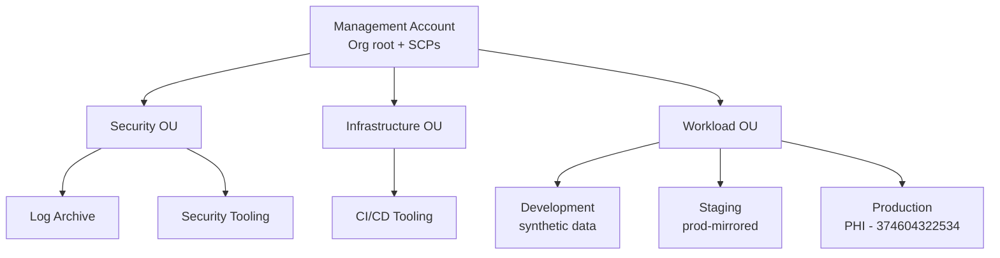
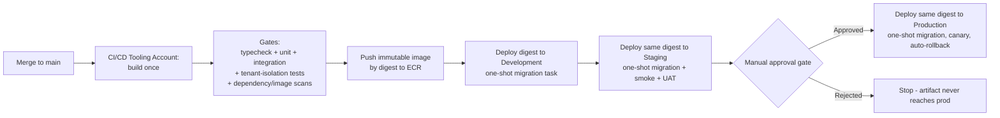

# ADR-001: Multi-Account Structure and Build-Once Promotion Pipeline

**Date:** 2026-08-25
**Status:** Proposed
**Deciders:** Platform owner (approval pending), Architecture review (Kiro-assisted)
**Parent:** [High-Level Design](../high-level-design.md) §4, §5

## Context

Plexus Command Center is a HIPAA, PHI-bearing, pool-model clinical SaaS
(~20 clinics Year 1, ~80 by Year 3) running on AWS ECS Fargate + RDS PostgreSQL +
S3. The current AWS environment and release process have structural problems that
block a safe production launch:

- **Only two accounts exist:** production `374604322534` and a **combined dev/QA**
  account `107554921331`. There is no dedicated staging environment.
- **Environments overlap.** Dev and QA share infrastructure, and dev/QA roles can
  reach patient-named buckets (GAP-020). Blast radius between environments is not
  contained.
- **Non-production holds real PHI** (owner-confirmed), in environments with weaker
  controls, no CloudTrail, and a publicly-exposed EKS management plane
  (GAP-048/050). This is a Critical containment item.
- **The release process is unsafe.** A merge to `main` builds a mutable `latest`
  image and force-deploys straight to production with no tests, promotion,
  staging, stability checks, or rollback (GAP-037). Production ECS rollback is
  disabled.
- **Schema is mutated at runtime.** Every container start runs
  `npx drizzle-kit push --force` against the database (GAP-035), allowing
  implicit destructive schema reconciliation on production boot.

Constraints:

- We need a real place to **build and test (staging) that mirrors production**, so
  a release can be validated before it touches PHI.
- We must keep PHI only where it belongs and cover every PHI account under the
  existing **AWS BAA**.
- The team is small; operational overhead must stay proportional to ~80 tenants.
- Infrastructure-as-code already exists in the repo (`infrastructure/`, AWS CDK).

## Decision

Adopt an **AWS Organizations multi-account structure** with environment-separated
accounts, and replace the release process with a **build-once, promote-by-digest
pipeline** through Development → Staging → Production, with schema migrations run
as a gated one-shot task rather than at container startup.

### Account structure

```
Management Account (Org root; billing, SCPs; no workloads)
├── Security OU
│   ├── Log Archive Account        (central CloudTrail + S3 Object Lock audit logs, 6+ yr)
│   └── Security Tooling Account    (GuardDuty, Security Hub, Config aggregation)
├── Infrastructure OU
│   └── CI/CD Tooling Account       (pipeline, ECR, signed build artifacts)
└── Workload OU
    ├── Development Account          (synthetic data only)
    ├── Staging Account              (IaC-identical to prod; synthetic/de-identified data)
    └── Production Account           (PHI; existing 374604322534)
```



**Rules enforced by the structure:**

- Environments never share an account. Separate accounts are the isolation and
  blast-radius boundary.
- **Staging is IaC-identical to production** — same CDK stacks, same service
  topology, differing only in scale and non-PHI data. A release that passes in
  staging is the release that ships.
- **PHI lives only in Production.** Dev and Staging use synthetic or formally
  de-identified data. This is the target end-state for GAP-050; existing
  non-production PHI must be contained and migrated (see Consequences).
- **Service Control Policies** on the Workload OU: restrict region, prevent
  disabling CloudTrail/GuardDuty, and prevent tampering with encryption settings.
- The **AWS BAA must cover** Production and Log Archive (audit logs reference PHI
  resources) at minimum.

### Build-once promotion pipeline



**Pipeline principles:**

- **Build once.** A single immutable image is built in the CI/CD account and
  promoted by **digest** (never `latest`) to each environment. The artifact tested
  in staging is bit-for-bit the artifact deployed to production.
- **Mandatory gates before promotion:** typecheck, unit + integration tests,
  tenant-isolation/negative-authorization tests, and dependency/container image
  scans. Failing gates stop the pipeline.
- **Migrations as a gated one-shot task**, run before the new version takes
  traffic — **removed entirely from container startup** (closes GAP-035). Backed
  by a pre-migration backup checkpoint and a documented roll-forward/rollback.
- **Manual approval gate** between Staging and Production — the go/no-go control
  for a PHI system. (Later, if AI features are ever reclassified toward SaMD, this
  gate can become a 21 CFR Part 11 electronic signature.)
- **Canary deployment with automatic rollback** in production on health/SLO
  failure, replacing today's blind force-deploy.
- Cross-account deployment uses OIDC role assumption from the CI/CD account into
  each Workload account (no long-lived keys).

## Rationale

- **Environment-separated accounts** are AWS's standard practice and the cleanest
  way to fix the current dev/QA overlap and PHI leakage. At ~80 tenants, this
  gives the isolation we need without the overhead of account-per-tenant.
- **A prod-mirrored staging account** is the specific thing missing today. Without
  it there is nowhere to validate a release against production-like
  infrastructure before PHI is affected.
- **Build-once/promote-by-digest** guarantees that what was tested is what ships,
  and eliminates the mutable-`latest` risk (GAP-037).
- **One-shot migrations** remove destructive runtime schema reconciliation
  (GAP-035) and make schema change a reviewed, reversible step.
- **Central Log Archive with Object Lock** establishes the immutable audit
  retention HIPAA expects and doubles as SOC 2 / HITRUST evidence later.

## Alternatives Considered

### Option A: Stay on two accounts, add a staging *environment* inside the dev/QA account
- **Description:** Create a separate staging namespace/stack within the existing
  combined account.
- **Pros:** Cheapest; no new accounts to create.
- **Cons:** Environments still share an account boundary; PHI and non-PHI stay
  co-mingled; no blast-radius containment; does not fix GAP-020/050.
- **Why rejected:** It preserves the core isolation problem the request is trying
  to solve.

### Option B: Account-per-tenant (silo)
- **Description:** One AWS account per clinic.
- **Pros:** Strongest tenant isolation; per-tenant cost attribution.
- **Cons:** Very high operational overhead; ~80 accounts to manage; unnecessary
  for a pool-model application at this scale.
- **Why rejected:** Over-engineered for ~20→~80 tenants; the pool model with
  fail-closed `clinic_id` scoping (ADR-002) is sufficient.

### Option C: Blue/green in a single production account, no separate staging
- **Description:** Two prod environments, flip traffic between them.
- **Pros:** Fast rollback within prod.
- **Cons:** No pre-prod validation against a separate account; PHI blast radius
  unchanged; doesn't provide a safe build/test environment.
- **Why rejected:** Doesn't meet the "build and test in staging, then deploy to
  prod" requirement.

## Consequences

### Positive
- Clean environment isolation; contained blast radius.
- A real, prod-mirrored place to build and test before touching PHI.
- What is tested is what ships; safe, reversible releases with rollback.
- Runtime schema mutation eliminated.
- Central immutable audit logging; foundation for SOC 2 / HITRUST.

### Negative (accepted trade-offs)
- More AWS accounts to create and govern (mitigated by Organizations + SCPs + IaC).
- Higher baseline cost (a full staging environment; can be scaled down).
- Migration effort to move the existing prod account into the Org and stand up new
  accounts.

### Risks
- **Migrating the existing production account into an Organization** is a sensitive
  operation. Mitigation: plan and rehearse; the account owner performs it; no
  downtime-inducing change without an approved window.
- **Existing real PHI in dev/QA (GAP-050)** must be contained *before* those
  environments are rebuilt on synthetic data. Mitigation: privacy owner makes the
  reportable-incident determination; restrict access immediately; then migrate.
- **Cross-account IAM misconfiguration** could break deployments. Mitigation:
  least-privilege OIDC deploy roles, tested in dev/staging first.

## Implementation Notes (non-binding, for the follow-on plan)

1. Stand up the Organization, OUs, and SCPs from the Management account.
2. Create Log Archive, Security Tooling, CI/CD, Development, and Staging accounts.
3. Bring the existing production account into the Workload OU.
4. Codify all environments with the existing CDK so staging is IaC-identical to
   prod.
5. Move image build to the CI/CD account; make ECR immutable; deploy by digest.
6. Extract schema migration into a one-shot task; remove `drizzle-kit push
   --force` from the `Dockerfile` startup command (GAP-035).
7. Add the mandatory test/scan gates and the staging→prod approval gate.
8. Add canary + automatic rollback in production.
9. Contain non-production PHI, then rebuild Dev/Staging on synthetic data.

> These are engineering and account-owner actions. This ADR records the decision;
> creating accounts, moving the prod account, signing/confirming BAA scope, and
> running production migrations remain authorized owner actions.

## References
- AWS: [Organizing Your AWS Environment Using Multiple Accounts](https://docs.aws.amazon.com/whitepapers/latest/organizing-your-aws-environment/)
- AWS: [Building a Cross-Account CI/CD Pipeline](https://aws.amazon.com/blogs/devops/cross-account-ci-cd-pipeline-single-tenant-saas/)
- Power steering: `resilience-and-deployment.md`
- Gap register: `docs/GAP_ANALYSIS.md` (GAP-020, GAP-035, GAP-037, GAP-048, GAP-050)

## Related Artifacts
- [High-Level Design](../high-level-design.md) — §4 (account structure), §5 (deployment flow)
- ADR-002 (planned) — fail-closed pool tenancy
- ADR-003 (planned) — migrations as gated one-shot task (elaborates the migration
  decision referenced here)
