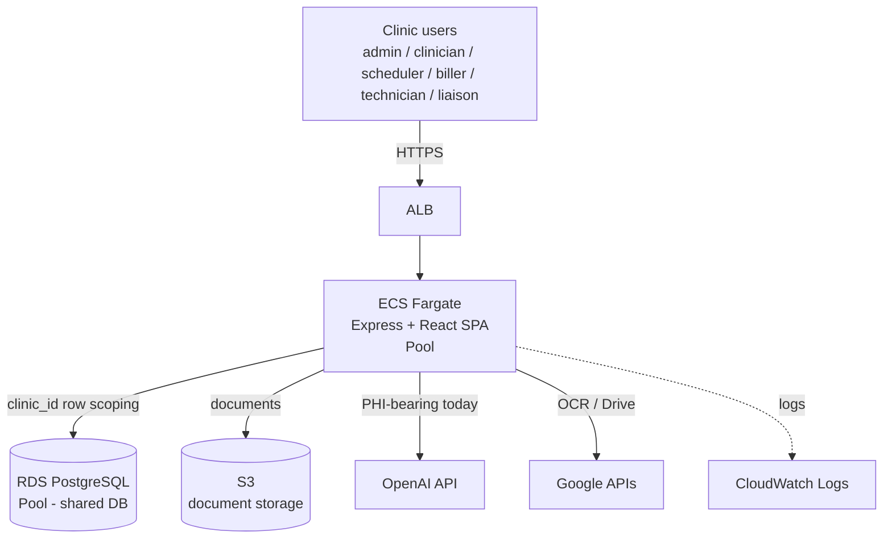
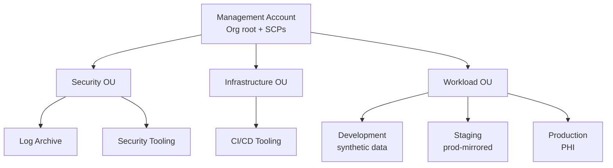
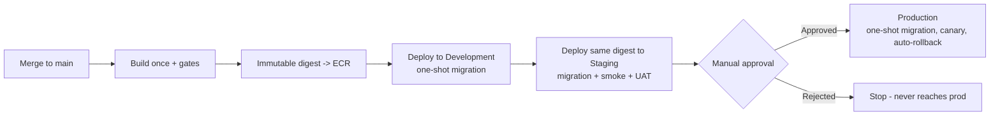

# High-Level Design

**Product:** Plexus Command Center (houses the Plexus Ancillary application)
**Date:** 2026-08-25
**Version:** 0.2 (Draft)
**Segment:** EHR-adjacent / clinical workflow SaaS
**Regulatory Scope:** HIPAA (certified; PHI throughout). HITRUST and SOC 2 are future goals (roadmap in §7). 42 CFR Part 2 **out of scope** (no substance-use-disorder data). FDA/SaMD: **CDS-exemption expected** (clinician-in-the-loop) — pending qualified regulatory confirmation.
**Authors:** Architecture review (Kiro-assisted), pending owner review

> This is the master system document. It references detail artifacts rather than
> duplicating them. Where a fact is not yet established, it is marked
> **NEEDS INPUT** rather than guessed.

---

## 1. Executive Summary

Plexus Command Center is a multi-tenant clinical operations platform whose
clinical core, Plexus Ancillary, ingests patient screening batches, determines
qualifying ancillary tests with AI assistance, and drives the downstream
engagement, scheduling, billing, and document workflow. Tenants are clinics; the
platform runs a **pool** tenancy model — one shared application and one shared
PostgreSQL database, with tenant separation enforced by a `clinic_id` column on
each row and an `admin` role that bypasses clinic scoping. It is built as a React
SPA and an Express/TypeScript API packaged as a single container on AWS ECS
Fargate, backed by RDS PostgreSQL and S3 for documents. The current production
posture is **NOT DEPLOY READY**: a companion audit (`docs/GAP_ANALYSIS.md`)
records 50 gaps including fail-open tenant isolation, an unsafe direct-to-prod
pipeline, runtime schema mutation on every container start, and unresolved AI and
data-governance questions. The most consequential near-term architecture work is
(a) making tenant isolation fail-closed and (b) replacing the deployment model
with a build-once, promote-through-staging pipeline across properly separated AWS
accounts.

---

## 2. System Context

### Users and Personas

Roles are defined in code (`shared/schema/users.ts`: `USER_ROLES`). Authentication
today is **session-based, local username/password via Passport** with
PostgreSQL-backed sessions — not federated identity.

| Persona | Description | Authentication (current) | Primary Use Cases |
|---|---|---|---|
| Admin | Platform administrator; bypasses clinic scoping and sees all clinics | Session cookie (Passport local) | User management, admin approval gates, audit/analysis oversight, all-clinic visibility |
| Clinician | Clinical user within a clinic | Session cookie (Passport local) | Review screenings, qualifying-test reasoning, notes |
| Scheduler | Schedules qualified patients | Session cookie (Passport local) | Scheduling triage, assignment boards, calendar |
| Biller | Billing/invoicing user | Session cookie (Passport local) | Invoices, billing readiness, financial events |
| Technician | Ancillary test/technical role | Session cookie (Passport local) | Procedure events, test workflow |
| Liaison | Engagement/outreach role | Session cookie (Passport local) | Engagement baskets, outreach, contact workflow |

**Decided (2026-08-25):** **No SSO/SAML federation for launch.** Local
username/password auth is sufficient. This does not remove the requirement to
harden sessions and passwords (session regeneration, revocation on role/password/
status change, strong password policy, MFA, rate limiting — GAP-006/008).

### External Systems

| System | Integration Type | Protocol | Direction |
|---|---|---|---|
| OpenAI (current) | AI screening / note generation / scheduler assist | HTTPS API | Outbound (PHI-bearing; migration to Bedrock recommended — see §6 and ADR-004) |
| EMR: eClinicalWorks, athenahealth (+ general EMR capability) | Schedule sync into the platform | Application-level (`server/routes/emrScheduleSync.ts`) | Inbound |
| FHIR import (dev-observed) | Bulk clinical import | FHIR | Inbound (import correctness open, GAP-011/012) |
| Email/SMS providers | Outreach, notifications | HTTPS API | Outbound (feature-flagged) |

**Decided (2026-08-25):**
- **No Google integration.** Removed from architecture and BAA scope.
- **EMR targets:** eClinicalWorks and athenahealth today, with a stated goal of
  broad EMR-integration capability. Broad EMR interoperability (FHIR/HL7/SMART on
  FHIR) is tracked as its own future workstream, not a launch dependency.

### Regulatory Scope

- **HIPAA:** Applies; organization is HIPAA-certified. The platform stores and
  processes PHI (patient names, DOB, contact info, diagnoses, medications,
  clinical history, insurance) — see `shared/schema/screening.ts`.
- **AI + PHI (GAP-015):** The screening/note workflow sends clinical data to
  OpenAI today. An **AWS BAA is in place**; the recommended path is migrating AI
  inference to **Amazon Bedrock** (HIPAA-eligible, covered by the AWS BAA) so PHI
  inference stays within a BAA-covered boundary — see §6 and ADR-004. Until then,
  a signed OpenAI BAA and minimum-necessary payload are required.
- **FDA / SaMD — CDS exemption expected (GAP-047):** A licensed clinician
  independently reviews and approves **every** AI test recommendation before it
  drives action, and the system presents the basis for the recommendation. This
  is expected to meet the FDA Clinical Decision Support (CDS) **exemption**, not
  SaMD. Two conditions to preserve it: (a) the human-review step must be enforced
  in software (AI output is a draft, never auto-committed), and (b) approval
  should be captured as a signed, audited event. **Requires qualified regulatory
  confirmation** — this document does not make the legal classification.
- **42 CFR Part 2:** **Out of scope** — no substance-use-disorder data.
- **HITRUST / SOC 2:** Future goals; see the compliance roadmap in §7.
- **State laws:** Assumed US general; no state-specific triggers identified yet.

---

## 3. Logical Architecture

### Components and Responsibilities

The application is a modular monolith: one Express process registers many route
modules (`server/routes/*`) over one shared schema (`shared/schema/*`). All
components are **pool** tenancy (shared compute + shared DB, row-level
`clinic_id`).

| Component (grouped) | Responsibility | Tenancy | Key Dependencies |
|---|---|---|---|
| Identity & access | Login/logout, sessions, users, roles | Pool | Passport, connect-pg-simple, `users`/`clinics` |
| Screening core (Plexus Ancillary) | Batch import, patient screening, qualifying-test reasoning | Pool | RDS, OpenAI, `screening` schema |
| Engagement | Baskets, assignment board, distribution, team metrics, outreach | Pool | RDS, `engagement` schema |
| Scheduling | Triage, scheduler assignments, appointments, global schedule, AI assist | Pool | RDS, OpenAI |
| Billing & invoicing | Billing policy/readiness/reports, invoices, delivery, financial events, cash pricing | Pool | RDS, `billing`/`invoices` schemas |
| Documents | Document library/readiness, packets, ancillary templates, generated notes | Pool | RDS, S3, Google OCR |
| Patient records | Patient directory, patient database, notes, history, references, contacts | Pool | RDS, `patientDirectory` schema |
| Portals | Physician portal, team portal widgets/prefs, portal assistant | Pool | RDS |
| Admin & audit | Admin settings, audit log, analysis jobs, mission control, home stats | Pool | RDS, `audit`/`analysisJobs` schemas |
| Platform lifecycle | Startup boundary, background services, health/readiness | Pool (shared) | RDS |

### Control Plane / Application Plane Boundary

The platform does **not** currently implement a distinct SaaS control plane
(tenant lifecycle, onboarding, metering, billing-of-tenants) separate from the
application plane. Tenant creation is a `clinics` row; user provisioning is manual
admin action. Establishing a proper control-plane/application-plane split is a
future maturity step, not a launch blocker for the current pool model.

### Multi-Tenant Model Summary

Every tenant is a row in `clinics` (`shared/schema/clinics.ts`); every data row
carries a nullable `clinic_id`. Tenant scope is applied in the repository layer,
and the `admin` role intentionally bypasses it. The critical known weakness
(GAP-001) is that scoping is **fail-open**: when `clinic_id` is null/undefined the
filter is dropped, and several reads/writes constrain by record ID alone. Making
this **fail-closed** is the top application-security priority.

→ See **Tenant Isolation Matrix** (planned) for per-component detail.

---

## 4. Physical Architecture on AWS

### Architecture Diagram (current, single shared stack)

### AWS Account Structure — Target

Current state: production account `374604322534` and a **combined** dev/QA account
`107554921331`; no true staging; environments overlap. Target structure under a
single AWS Organization:

| Account | Purpose | OU |
|---|---|---|
| Management | Organizations root, billing, SCPs; no workloads | (root) |
| Log Archive | Central CloudTrail + S3 Object Lock audit logs (6+ yr) | Security |
| Security Tooling | GuardDuty, Security Hub, Config aggregation | Security |
| CI/CD Tooling | Pipeline, ECR, signed build artifacts | Infrastructure |
| Development | Fast iteration, synthetic data only | Workload |
| Staging | Prod-mirrored (IaC-identical), synthetic/de-identified data | Workload |
| Production | PHI; existing `374604322534` | Workload |

**Principles:** environments never share an account; staging is IaC-identical to
production; PHI lives only in production; SCPs on the Workload OU lock region and
prevent disabling CloudTrail/GuardDuty. The AWS BAA must cover every
PHI-touching account (Production and Log Archive at minimum).

→ See **Multi-Account & Promotion Pipeline ADR-001** (planned) for full rationale
and migration path.

### Regions and Data Residency

- **Primary region:** `us-east-1` (per current `deploy.yml`).
- **DR region:** **NEEDS INPUT** — no DR region defined; RPO/RTO not yet set.
- **Data residency constraints:** **NEEDS INPUT** — assumed US-only pending
  compliance confirmation.

### Networking Summary

- **Ingress:** ALB in front of ECS Fargate.
- **WAF:** Present in prod but attached to a different ALB and in Count-only mode
  (GAP-027) — effectively not enforcing.
- **Egress:** Outbound to OpenAI/Google over the internet today; VPC endpoints
  are not in place (GAP-033).

→ See `api-gateway-and-networking.md` steering for target networking patterns.

---

## 5. Key Data Flows

### PHI Data Flow (high level)

PHI enters via batch import / EMR schedule sync / manual entry, is stored in RDS
(`patient_screenings` and related tables), is sent to the AI provider during
screening/note generation, and exits via documents (S3), outreach, and downstream
billing. AI recommendations are stored as drafts and require licensed-clinician
review/approval before driving action. Encryption-in-transit and at-rest exist,
but PHI-to-AI governance and historical-log containment need closure
(GAP-004/015/016); moving inference to Bedrock (§6) keeps PHI inference inside the
AWS BAA boundary.

→ See **PHI Data Flow Map** (planned) for per-hop encryption and audit detail.

### Tenant Onboarding

A tenant is created as a `clinics` row; users are provisioned manually by an
admin. There is no automated onboarding orchestration today. Initial
administrator provisioning is now fail-closed (the app refuses to start with no
users — WP2), so a first admin must be provisioned out of band.

→ See **Onboarding Flow** (planned).

### Deployment Flow — Target

Build once in the CI/CD account; run mandatory gates (typecheck, unit +
integration, tenant-isolation/negative-authorization tests, dependency/image
scans); push an immutable image by digest; deploy that same digest to Dev →
Staging → Production; run schema migrations as a gated one-shot task (removed from
container startup); require manual approval before prod; use canary with automatic
rollback.

---

## 6. Security and Compliance Posture

### Tenant Isolation

Pool model with row-level `clinic_id` scoping and `admin` bypass. **Current
scoping is fail-open (GAP-001)** — the top application-security risk. Target:
immutable session-derived tenant context, ID-plus-tenant predicates on every
read/write, an explicitly separate admin path, and negative cross-tenant tests.

→ See **Tenant Isolation Matrix** (planned).

### Identity and Access

- **Provider:** Passport local strategy; PostgreSQL-backed sessions
  (connect-pg-simple). **No SSO/SAML for launch** (decided).
- **Known gaps:** no session regeneration on login, no revocation on
  role/password/deactivation change, one-character passwords accepted, no MFA,
  CSRF, Helmet baseline, or rate limiting (GAP-006, GAP-008).
- **Bootstrap:** default `admin/admin` seed removed; startup fails closed without
  a provisioned user (WP2).

→ See `identity-and-onboarding.md` steering.

### Clinical AI Governance

- **Provider (current → target):** OpenAI today; **migrate to Amazon Bedrock**,
  which is HIPAA-eligible and covered by the in-place AWS BAA, so PHI inference
  stays within a BAA-covered boundary. See ADR-004.
- **Human-in-the-loop (CDS exemption control):** every AI test recommendation is
  reviewed and approved by a licensed clinician before it drives action. This
  must be **enforced in software** — AI output persists as a draft
  (`adminApprovalStatus` gate in `screening.ts`) and is never auto-committed to
  the record. This control is what is expected to keep the product within FDA's
  CDS exemption.
- **AI audit trail:** log per-inference metadata — tenant, user, patient record
  id, model id/version, prompt/response hashes, guardrails, approval status,
  reviewer, and review outcome — to encrypted, retained storage. Bedrock model
  invocation logging provides prompt/response capture natively.
- **Dual-zone pattern (target):** the AI-calling path may invoke Bedrock but must
  not hold direct access to the PHI datastore; a controlled gate fetches
  minimum-necessary fields, builds the prompt, and writes results back. Limits
  blast radius and prompt-injection exfiltration risk.

→ See `genai-and-phi.md` steering and **PHI Data Flow Map** (planned).

### Encryption

- **At rest:** RDS and S3 encrypted; per-tenant CMK strategy not in place (pool
  model uses shared keys).
- **In transit:** TLS at the ALB; however production runtime disables DB TLS
  verification (`NODE_TLS_REJECT_UNAUTHORIZED=0`, `PGSSLMODE=no-verify`) and runs
  `NODE_ENV=development` (GAP-019) — must be corrected before production.

→ See `phi-data-handling.md` steering.

### Audit and Observability

- **Infrastructure audit:** Production CloudTrail is multi-region and encrypted
  but management-events-only; dev has none (GAP-022).
- **Application audit:** `audit` schema exists; complete PHI access/mutation/
  export coverage with immutable retention is not demonstrated (GAP-014).
- **PHI-safe logging:** WP1 introduced allowlisted, PHI-safe structured logging
  and correlated generic error envelopes (GAP-004/005/016 source-remediated,
  not yet deployed; historical logs still need controlled review).

→ See **Audit Log Coverage Matrix** (planned).

### HIPAA Eligibility and BAA Chain

- **AWS BAA:** **In place.** Must cover every PHI-touching account (Production and
  Log Archive at minimum). Migrating AI to Bedrock brings AI inference under this
  existing BAA.
- **Subprocessors:** OpenAI is the only external AI processor (Google removed).
  While OpenAI remains in use for PHI, a signed OpenAI BAA is required; the
  Bedrock migration eliminates this dependency.

→ See **HIPAA Service Eligibility Matrix** and **BAA Inventory** (planned).

---

## 7. Operational Characteristics

### Scalability

- **Tenant growth target:** ~20 clinics in Year 1, ~80 by Year 3.
- **Implication:** the **pool model is confirmed appropriate** at this scale —
  account-per-tenant or cell-based architecture is not needed. A single,
  well-isolated shared stack with fail-closed `clinic_id` scoping is the right
  design for 80 tenants.
- **Current scaling:** Single ECS task, Single-AZ RDS (GAP-025) — no headroom or
  failover; must reach at least two tasks and Multi-AZ before production.

### Availability and DR

Proposed defaults for owner approval (HIPAA sets no fixed numbers; these reflect
clinical impact and are conservative for a pool-model SaaS at this scale):

| Data tier | RPO (proposed) | RTO (proposed) |
|---|---|---|
| Clinical data (RDS patient records) | ≤ 1 hour | ≤ 4 hours |
| Non-clinical services | ≤ 24 hours | ≤ 8 hours |

**What HIPAA requires (§164.308(a)(7)):** a documented contingency plan with
(a) a data backup plan, (b) a disaster recovery plan, and (c) an emergency-mode
operation plan. HIPAA does not mandate specific RPO/RTO values — the organization
sets them.

**Concrete actions to satisfy it:**
- Multi-AZ RDS for automatic failover.
- Automated encrypted backups with a defined retention period + AWS Backup.
- RDS deletion protection.
- A cross-region encrypted backup copy for a defined DR region.
- **Perform and document a restore test** (backups alone do not prove
  recoverability — GAP-024).
- Write the contingency plan document (backup / DR / emergency-mode).

- **DR region:** proposed secondary region for backup copies — **owner to
  select** (e.g., `us-west-2`).

### Compliance Roadmap (HIPAA → HITRUST → SOC 2)

The organization is HIPAA-certified today. Recommended sequence:

| Phase | Target | Depends on | Notes |
|---|---|---|---|
| Now | Maintain HIPAA | BAA in place; close Sprint 0 gaps | PHI-in-dev/QA containment is the urgent item |
| Next | **SOC 2 Type I → Type II** | Audit logging, access control, change management, monitoring (much overlaps Sprint 0/1 gaps) | SOC 2 is often pursued first — it is control-and-evidence driven and aligns with the pipeline/audit work already planned |
| Then | **HITRUST CSF** | SOC 2 controls + formal risk management, mapped control inheritance from AWS | HITRUST is the heaviest; inherit AWS control coverage where possible |

Much of the SOC 2/HITRUST control set is the same work as the Sprint 0/1
remediation (audit logging, least privilege, change control, monitoring, backup/
DR, encryption). Doing the production-readiness remediation well builds most of
the SOC 2 evidence base as a byproduct.

→ See **HITRUST Control Inheritance Matrix** (planned) when HITRUST work begins.

### Deployment

- **Current:** merge to `main` builds mutable `latest` and force-deploys straight
  to production with no gates, promotion, staging, or rollback (GAP-037);
  container startup runs `npx drizzle-kit push --force` on every boot (GAP-035).
- **Target:** build-once digest promotion through Dev → Staging → Prod with gates,
  one-shot migrations, canary, and automatic rollback (Section 5).

→ See `resilience-and-deployment.md` steering and ADR-001 (planned).

### Observability

- **Tenant-aware logging:** WP1 logger is PHI-safe and allowlisted; per-tenant
  metrics/dimensions not yet established.
- **Alarms:** production lacks application SLO/security/DB/backup alarms
  (GAP-026); log retention is largely unbounded and unencrypted.

→ See `observability-and-operations.md` steering.

---

## 8. Key Architectural Decisions

| # | Decision | Date | Status | Link |
|---|---|---|---|---|
| ADR-001 | Multi-account structure (Dev/Staging/Prod under Organizations) + build-once promotion pipeline | 2026-08-25 | Proposed | [ADR-001](./adr/ADR-001-multi-account-structure-and-promotion-pipeline.md) |
| ADR-002 | Keep pool tenancy for launch (confirmed by ~20→~80 clinic scale); make `clinic_id` scoping fail-closed | 2026-08-25 | Proposed | [ADR-002](./adr/ADR-002-fail-closed-pool-tenancy.md) |
| ADR-003 | Remove runtime schema push; migrations as gated one-shot task | 2026-08-25 | Proposed | [ADR-003](./adr/ADR-003-migrations-as-gated-one-shot-task.md) |
| ADR-004 | Migrate clinical AI inference from OpenAI to Amazon Bedrock (HIPAA-eligible, under AWS BAA); dual-zone pattern | 2026-08-25 | Proposed | [ADR-004](./adr/ADR-004-openai-to-bedrock-phi-inference.md) |
| ADR-005 | Local auth only for launch (no SSO/SAML); harden sessions/passwords | 2026-08-25 | Proposed | [ADR-005](./adr/ADR-005-local-auth-and-session-hardening.md) |

---

## 9. Open Questions and Risks

### Resolved (2026-08-25)

| # | Question | Resolution |
|---|---|---|
| 1 | SSO/SAML federation? | **No SSO for launch** — local auth only |
| 2 | FDA/SaMD or GxP scope? | **CDS exemption expected** (clinician reviews every recommendation); regulatory confirmation still required |
| 3 | AWS BAA covering PHI accounts? | **Yes, in place**; verify it covers Production + Log Archive |
| 4 | HITRUST / SOC 2 / 42 CFR Part 2? | HITRUST/SOC 2 are **future goals** (roadmap in §7); 42 CFR Part 2 **out of scope** (no SUD data) |
| 5 | Which EHR(s)? | **eClinicalWorks + athenahealth**, plus general EMR-integration goal |
| 7 | Year 1 / Year 3 clinic counts? | **~20 / ~80** — pool model confirmed |

### Open Questions (remaining)

| # | Question | Impact | Owner | Due |
|---|---|---|---|---|
| 6 | Confirm proposed RPO/RTO defaults (≤1h/≤4h clinical) and select DR region | High | Ops/Business | TBD |
| 9 | Regulatory sign-off that clinician-in-the-loop keeps the product within FDA CDS exemption | High | Regulatory/Clinical | TBD |
| 10 | OpenAI BAA status while OpenAI remains in use (until Bedrock migration completes) | High | Compliance | TBD |
| 11 | PHI in dev/QA: **live data removed (2026-08-25)**; still open — verify snapshots/backups clean, fix recurrence path, complete reportability determination | High (was Critical) | Data/Privacy owner | Determination ASAP |

### Known Risks (from the gap register)

| # | Risk | Likelihood | Impact | Mitigation |
|---|---|---|---|---|
| 1 | Fail-open tenant isolation → cross-clinic PHI access (GAP-001) | H | H | Fail-closed context + ID-plus-tenant predicates + negative tests |
| 2 | Direct-to-prod pipeline, no rollback (GAP-037) | H | H | Build-once promotion + gates + canary + auto-rollback |
| 3 | Runtime `drizzle-kit push --force` (GAP-035) | H | H | One-shot gated migrations; remove from startup |
| 4 | PHI to external AI (OpenAI) while migration pending (GAP-015) | M | H | Migrate inference to Bedrock (AWS BAA); interim signed OpenAI BAA + minimum-necessary payload |
| 5 | Prod runs dev mode / DB TLS unverified (GAP-019) | H | H | Production mode + enforced TLS verification |
| 6 | Real PHI in dev/QA (GAP-050) — **live data removed 2026-08-25** | M (was H) | H | Verify snapshots/backups clean; fix recurrence path; complete reportability determination; seed Dev/Staging from synthetic data only |
| 7 | Loss of CDS exemption if AI output auto-commits | L | H | Enforce draft→clinician-review→approve in software; capture approval as signed audited event |

---

## 10. Related Artifacts

- [Production-Readiness Gap Register](../GAP_ANALYSIS.md) — baseline audit
- Multi-Account & Promotion Pipeline **ADR-001** — planned (next)
- Tenant Isolation Matrix — planned
- HIPAA Service Eligibility Matrix — planned
- PHI Data Flow Map — planned
- BAA Inventory — planned
- SaaS + Healthcare Lens Review Report — planned
- [Architecture Space landing page](./README.md) · [Change Log](./CHANGELOG.md)
