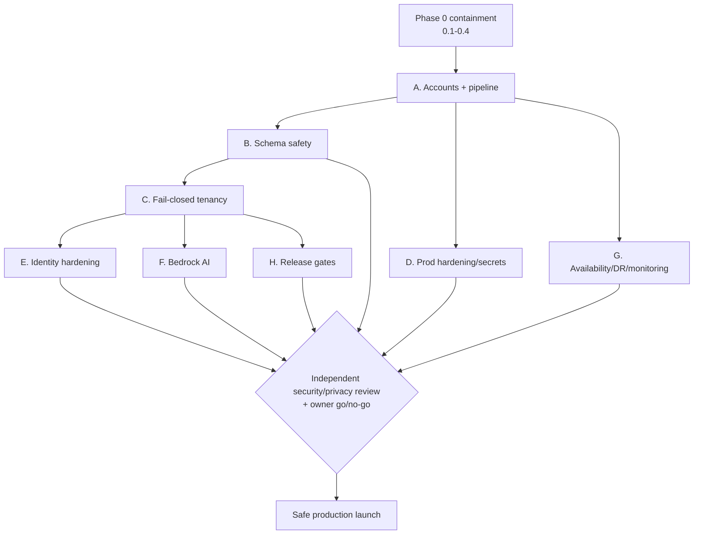

# Phase 1 Execution Plan — Path to a Safe Production Launch

**Generated:** 2026-08-25
**Product:** Plexus Command Center (Plexus Ancillary application)
**Parent:** [SaaS + Healthcare Lens Review](./saas-healthcare-lens-review-2026-08-25.md) · [High-Level Design](./high-level-design.md)

This turns the roadmap into an executable, sequenced plan. It covers **Phase 0
(containment, now)** and **Phase 1 (Sprint 0 release blockers)** — the work that
gets Plexus Command Center from *NOT DEPLOY READY* to a safe production launch.

> **How to read this:** each workstream lists concrete tasks, the owner, whether
> it is code (Kiro can implement) or an authorized owner action (account/data/
> legal), dependencies, and a definition of done. Ordering matters — later
> workstreams depend on earlier ones.

**Legend — Owner type:**
`CODE` = implementable in-repo · `AWS` = authorized AWS/account owner ·
`DATA` = data/privacy owner · `REG` = regulatory/clinical · `MIX` = code + owner action.

---

## Phase 0 — Containment (start immediately, parallel to planning)

These are not "launch tasks" — they reduce active risk now.

> **Update 2026-08-25:** Owner reported **PHI removed from dev/QA** (0.2 done).
> Remaining Phase 0 items: confirm removal also covered snapshots/backups (0.2a),
> fix the root cause that placed PHI there so it does not recur (0.2b), complete
> the privacy/reportability determination (0.1), and finish the EKS management-
> plane lockdown (0.4). Live-data exposure is materially reduced; the
> determination and recurrence-prevention are still open.

| # | Task | Owner | Depends on | Definition of done |
|---|---|---|---|---|
| 0.1 | Privacy determination on **prior** real PHI in dev/QA; decide if reportable | DATA | — | **OPEN** — determination still owed even though data now removed |
| 0.2 | Remove PHI from dev/QA | AWS/DATA | — | **DONE (2026-08-25, owner-reported)** — see verification caveats below |
| 0.2a | Verify removal covers **snapshots/backups**, not just live stores | AWS | 0.2 | Confirmed no PHI remains in dev/QA DB snapshots, S3 versions, or backups |
| 0.2b | Fix the path that put PHI there (prod-copy process / shared creds) | MIX | 0.2 | Recurrence prevented; Dev/Staging seeded from synthetic data only |
| 0.3 | Interim OpenAI BAA + confirm minimum-necessary payload | REG/DATA | — | Signed BAA on file; payload reviewed |
| 0.4 | Restrict public EKS management plane; enable control-plane logging (GAP-048) | AWS | — | API not `0.0.0.0/0`; audit logs on |

Phase 0 does not block starting Phase 1 code work, but **launch cannot proceed
while 0.1–0.2 are open.**

---

## Phase 1 — Sprint 0 Release Blockers

### Workstream A — Foundation: accounts & pipeline (ADR-001)

| # | Task | Owner | Depends on | Done when |
|---|---|---|---|---|
| A.1 | Stand up AWS Organization, OUs, SCPs | AWS | — | Org + Security/Infra/Workload OUs live; SCPs enforce region + no-disable-CloudTrail |
| A.2 | Create Log Archive, Security Tooling, CI/CD, Dev, Staging accounts | AWS | A.1 | Accounts exist; BAA confirmed for PHI accounts |
| A.3 | Bring existing prod account into Workload OU | AWS | A.1 | Prod under Org; no disruption |
| A.4 | Codify all envs in CDK so **staging is IaC-identical to prod** | MIX | A.2 | `cdk diff` staging vs prod = topology-identical |
| A.5 | Move image build to CI/CD account; ECR immutable + scanning; deploy by digest | MIX | A.2 | No `latest`; images promoted by digest |
| A.6 | Build-once promotion pipeline: Dev → Staging → Prod, manual approval gate | MIX | A.4, A.5 | One artifact promoted across envs; prod gated on approval |
| A.7 | Canary + automatic rollback in prod | MIX | A.6 | Canary rollout; auto-rollback on health/SLO failure verified in staging |

### Workstream B — Schema safety (ADR-003)

| # | Task | Owner | Depends on | Done when |
|---|---|---|---|---|
| B.1 | Capture current **prod schema**; reconcile a clean baseline migration | AWS/CODE | A.2 | Baseline migration matches deployed schema (operator-verified) |
| B.2 | Remove `drizzle-kit push --force` from `Dockerfile`; app boot no longer mutates schema | CODE | B.1 | **DONE (2026-08-25)** — startup is `node dist/index.cjs`; added `db:migrate` (versioned `drizzle-kit migrate`) for the one-shot task; not yet committed |
| B.3 | Add one-shot migration task to the pipeline (backup checkpoint + verify) | MIX | A.6, B.1 | Migrations run as a gated step before traffic shift, with backup |
| B.4 | Adopt expand/contract migration convention | CODE | B.3 | Documented; rollback-compatible migrations |

### Workstream C — Tenant isolation, fail-closed (ADR-002) — top security priority

| # | Task | Owner | Depends on | Done when |
|---|---|---|---|---|
| C.1 | Replace overloaded `null`: explicit resolved `clinicId` **or** `platformAdmin` context | CODE | — | **DONE (2026-08-25)** — `tenantContext.ts` adds fail-closed discriminated union (`clinic`/`platform`/`denied`) + pure resolver + tests; populated on `req.tenant`; legacy `req.clinicId` retained for migration; not yet committed |
| C.2 | Enforce record-ID **+** `clinic_id` predicate in **repository layer** for all scoped reads/writes | CODE | C.1 | **IN PROGRESS** — pattern set (ADR-006); **screening repo done** + detached callers scoped (batch runner via captured scope, boot recovery via system scope); billing, docs, patient history, cooldown, notes, appointments still to migrate |
| C.3 | Explicit, separately-typed platform-admin all-clinic path | CODE | C.1 | Admin all-clinic access works via explicit path, not `null` fallback |
| C.4 | Backfill `clinic_id` on all rows; then `NOT NULL` on tenant tables | MIX | B.3, C.2 | No unscoped rows; column `NOT NULL` (via one-shot migration) |
| C.5 | S3 document keys tenant-prefixed; access scoped | CODE | C.1 | Objects under `clinic/{id}/…`; cross-tenant object access denied |
| C.6 | **Cross-tenant + wrong-role negative test suite**; wire as pipeline gate | CODE | C.2, A.6 | **HARNESS BUILT** — safe test-DB harness (`tests/integration/setup/testDb.ts`) + screening cross-tenant test (`tests/integration/tenantIsolation.screening.test.ts`), new `test:integration` script. Guards refuse non-test/app DBs (verified); skips cleanly without `TEST_DATABASE_URL` (verified). **Still needed:** provide a test DB (CI service or local compose) to actually execute the SQL-level assertions; add per-domain assertions as domains migrate; wire into pipeline gate |

### Workstream D — Production hardening & secrets

| # | Task | Owner | Depends on | Done when |
|---|---|---|---|---|
| D.1 | Run prod as `NODE_ENV=production`; enable DB TLS cert verification (remove `NODE_TLS_REJECT_UNAUTHORIZED=0`, `PGSSLMODE=no-verify`) (GAP-019) | MIX | A.4 | Prod in production mode; TLS verified; fail-closed if insecure |
| D.2 | Move DB/session/AI secrets to Secrets Manager / task roles; remove from env/source (GAP-018) | AWS/CODE | A.2 | No secrets in env/source; rotation configured |
| D.3 | S3: SSE-KMS, versioning, TLS-only policy, access logging; Object Lock for audit bucket (GAP-021) | AWS | A.2 | Buckets meet PHI config in the eligibility matrix |
| D.4 | Rotate credentials exposed as env values | AWS | D.2 | Old credentials revoked; rotation documented |

### Workstream E — Identity hardening (ADR-005)

| # | Task | Owner | Depends on | Done when |
|---|---|---|---|---|
| E.1 | Regenerate session on login; idle + absolute expiry | CODE | — | New session id on login; expiry enforced |
| E.2 | Revoke sessions on password/role/deactivation change | CODE | E.1 | Demoted/deactivated user's sessions stop working (tested) |
| E.3 | Strong password policy (remove `min(1)`) on create/change | CODE | — | Weak passwords rejected |
| E.4 | MFA for `admin`; login throttling; CSRF; security headers (Helmet); API rate limiting | CODE | — | Controls active; negative tests pass |
| E.5 | Restrict audit endpoints to admin + tenant scope (GAP-003) | CODE | C.1 | Audit routes require admin; scoped; minimum-necessary fields |

### Workstream F — Clinical AI to Bedrock (ADR-004)

| # | Task | Owner | Depends on | Done when |
|---|---|---|---|---|
| F.1 | Bedrock client behind existing `aiClient` interface; pick model (Claude; eval Nova) | CODE | A.2 | Bedrock path implemented; provider selectable by flag |
| F.2 | Dual-zone: AI path cannot read PHI store directly; controlled min-necessary gate | CODE | C.1 | AI path has no direct PHI-store access; gate passes/writes results |
| F.3 | Enable Bedrock invocation logging to SSE-KMS + Object Lock S3; VPC endpoint | AWS | A.2, D.3 | Prompts/responses logged, encrypted, restricted, retained; private traffic |
| F.4 | AI inference audit trail (tenant/user/patient/model/hashes/approval) | CODE | F.1 | Per-inference record emitted |
| F.5 | Enforce AI output as **draft**; clinician approval = signed, audited event | CODE | E.1 | No auto-commit; approval captured as signed event (CDS-exemption control) |
| F.6 | Parallel-run vs OpenAI on **synthetic** data; validate parity; cut over; retire OpenAI | MIX | F.1–F.5 | Parity accepted; OpenAI removed |

### Workstream G — Availability, DR, monitoring

| # | Task | Owner | Depends on | Done when |
|---|---|---|---|---|
| G.1 | Multi-AZ RDS; ≥2 ECS tasks | AWS | A.4 | Failover-capable; deployment headroom |
| G.2 | Automated encrypted backups + AWS Backup; deletion protection; cross-region copy | AWS | A.2 | Backups + retention + deletion protection configured |
| G.3 | **Perform and document a restore test** | AWS | G.2 | Restore succeeds; RPO/RTO measured and recorded |
| G.4 | Confirm RPO/RTO (proposed ≤1h/≤4h clinical); select DR region | AWS/Business | — | Approved RPO/RTO + DR region |
| G.5 | Central CloudTrail w/ data events → Log Archive (Object Lock); encrypted finite-retention logs | AWS | A.2 | Immutable audit trail; PHI-safe log retention |
| G.6 | GuardDuty / Config / Security Hub org-wide (GAP-023); prod alarms (GAP-026) | AWS | A.1 | Detection baseline on; SLO/security/DB/backup alarms live |
| G.7 | WAF on the app ALB, Block mode, rate rules (GAP-027) | AWS | A.4 | WAF enforcing; login/API rate rules |
| G.8 | Write HIPAA contingency plan (backup / DR / emergency-mode) | DATA/AWS | G.3 | Documented plan |

### Workstream H — Release gates & test discipline (GAP-038)

| # | Task | Owner | Depends on | Done when |
|---|---|---|---|---|
| H.1 | CI gate: typecheck + unit + integration + **tenant-isolation** tests | CODE | C.6 | Pipeline fails on any gate failure |
| H.2 | Dependency + container image scans in pipeline | MIX | A.5 | Scans gate promotion |
| H.3 | Synthetic-data smoke tests post-deploy (no PHI in CI) | CODE | A.6 | Smoke checks run in staging + prod canary |

---

## Suggested sequencing (critical path)

**Rationale:** accounts/pipeline first (everything deploys through it); schema
safety and prod hardening can proceed in parallel; **fail-closed tenancy (C) is
the pivotal security workstream** and gates identity, AI, and release-gate work;
availability/DR/monitoring proceed alongside; a final **independent security/
privacy review + owner go/no-go** precedes launch.

---

## What can start today (code, low-risk, reversible)

Ordered by value/effort, all implementable in-repo and independently reversible:

1. **B.2** — remove `drizzle-kit push --force` from the `Dockerfile` startup.
2. **D.1 (code portion)** — production-mode + DB TLS verification config (behind
   env, testable in staging).
3. **E.3** — strong password policy.
4. **E.1** — session regeneration on login.
5. **E.5** — restrict audit endpoints to admin.
6. **C.1** — introduce explicit tenant context type (foundation for C.2–C.6).

These do not require AWS/account changes and give immediate risk reduction while
the account-restructure (Workstream A) is arranged.

---

## Owner actions that gate launch (cannot be done by code alone)

- Phase 0 PHI determination + containment (DATA/AWS)
- Create accounts / move prod into Org / confirm BAA scope (AWS)
- Rotate exposed credentials (AWS)
- Verify prod schema baseline (AWS)
- Approve RPO/RTO + DR region; run restore test (AWS/Business)
- Regulatory confirmation of CDS exemption (REG)
- Independent security/privacy review + production go/no-go (owner)

---

## Related Artifacts

- [SaaS + Healthcare Lens Review](./saas-healthcare-lens-review-2026-08-25.md) — the roadmap this plan executes
- [High-Level Design](./high-level-design.md)
- ADRs [001](./adr/ADR-001-multi-account-structure-and-promotion-pipeline.md)–[005](./adr/ADR-005-local-auth-and-session-hardening.md)
- [Tenant Isolation Matrix](./tenant-isolation-matrix.md) · [HIPAA Service Eligibility Matrix](./hipaa-service-eligibility-matrix.md) · [PHI Data Flow Map](./phi-data-flow-map.md)
- [Gap Register](../GAP_ANALYSIS.md)
