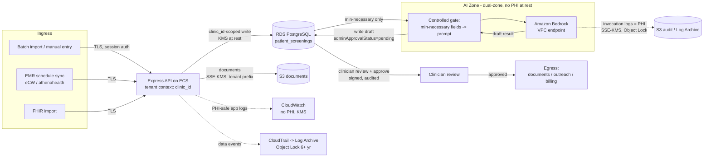

# PHI Data Flow Map

**Generated:** 2026-08-25
**Product:** Plexus Command Center (Plexus Ancillary application)
**Parent:** [High-Level Design](./high-level-design.md) §5 · **AI decision:** [ADR-004](./adr/ADR-004-openai-to-bedrock-phi-inference.md)

This map traces Protected Health Information (PHI) from entry to exit, with the
encryption, tenant-scoping, and audit expected at each hop. It shows **current
state** and the **target** once ADR-002/003/004 and the §6 fixes are in place.

**PHI in this system** (from `shared/schema/screening.ts`): patient name, DOB,
age, gender, phone, email, insurance, diagnoses, clinical history, medications,
previous tests, notes, and AI reasoning — all clinical/identifiable.

---

## 1. End-to-end flow (target)

---

## 2. Per-hop detail

| # | Hop | PHI? | Encryption in transit | Encryption at rest | Tenant scoping | Audit | Current gaps |
|---|---|---|---|---|---|---|---|
| 1 | Ingress → API (import / EMR sync / FHIR / manual) | Yes | TLS at ALB | n/a | Session → `clinic_id` context | Request telemetry (PHI-safe, WP1) | Session hardening pending (ADR-005); FHIR import correctness (GAP-011/012) |
| 2 | API → RDS (write/read screening + clinical) | Yes | TLS (**verification disabled today**) | KMS at rest | `clinic_id` predicate | App audit (`audit` schema) | **RDS TLS not verified + prod dev-mode (GAP-019)**; **fail-open/ID-only scoping (GAP-001)** |
| 3 | API → S3 (documents) | Yes | TLS | **SSE-S3 today; target SSE-KMS** | Target: tenant-prefixed keys | Access logging (target) | SSE-S3 not KMS, no versioning/Object Lock/access logging (GAP-021); ID-only doc reads |
| 4 | RDS → AI gate (min-necessary fields) | Yes | In-process / TLS | n/a | `clinic_id`-scoped fetch | Inference audit (target) | Today the full prompt is built and sent to OpenAI (external) |
| 5 | AI gate → model | Yes | TLS (**target: VPC endpoint, private**) | Provider-side (target: Bedrock under AWS BAA) | Per-inference tenant tag | **Invocation logging (Bedrock, target)** | **OpenAI external, outside AWS BAA (GAP-015)**; no invocation log today |
| 6 | Model → RDS (draft result) | Yes | In-process | KMS at rest | `clinic_id` | Draft write audited | AI output must persist as **draft**, never auto-commit |
| 7 | Clinician review → approval | Yes | TLS | KMS | `clinic_id` + role | **Signed, audited approval** (CDS-exemption control) | Approval-as-signed-event not yet formalized |
| 8 | Approved → egress (documents / outreach / billing) | Yes | TLS | KMS | `clinic_id` | Egress audit | Outreach/messaging feature-flagged; minimum-necessary on export |
| L | App → CloudWatch logs | **Must be NO** | TLS | KMS (target) | Tenant id in log, no PHI | — | Historical logs may contain PHI (GAP-004/016); retention unbounded |
| A | AI invocation logs → S3 | **Yes (prompts)** | TLS | SSE-KMS + Object Lock (target) | Restricted to audit roles | Immutable, 6+ yr | Not present until Bedrock migration |
| C | Data events → CloudTrail → Log Archive | Indirect | TLS | KMS + Object Lock | Central account | Immutable | Prod management-events-only; dev none (GAP-022) |

---

## 3. Key invariants (target)

1. **PHI never leaves the AWS BAA boundary.** After ADR-004, inference is on
   Bedrock via VPC endpoint; OpenAI (external) is retired.
2. **The AI layer holds no PHI at rest.** Dual-zone: the AI path cannot read the
   PHI store directly; a controlled gate passes minimum-necessary fields and
   writes results back.
3. **AI output is always a draft** (`adminApprovalStatus = pending`) until a
   licensed clinician reviews and approves. Approval is a signed, audited event.
   This is the control that preserves the FDA CDS exemption.
4. **Every scoped hop carries `clinic_id`** and denies on missing scope
   (fail-closed, ADR-002).
5. **Two log classes, treated differently:** application logs must contain **no
   PHI** (WP1 PHI-safe logger); AI invocation logs **are PHI** and get SSE-KMS +
   Object Lock + restricted access + 6-year retention.

---

## 4. Historical containment (out-of-band)

Because prior logging may have written PHI to CloudWatch, and persisted
diagnostic fields (e.g., `analysis_jobs.errorMessage`) may retain pre-remediation
content (GAP-004/016), a **privacy-owner-led review** of historical logs/data is
required — separate from the forward-looking flow above. Searching those logs can
itself expose PHI, so it must follow an approved incident/review procedure.

---

## 5. Related Artifacts

- [High-Level Design](./high-level-design.md) — §5 (data flows), §6 (governance)
- [ADR-004: OpenAI → Bedrock](./adr/ADR-004-openai-to-bedrock-phi-inference.md) — dual-zone, invocation logging
- [ADR-002: Fail-Closed Tenancy](./adr/ADR-002-fail-closed-pool-tenancy.md) — `clinic_id` scoping per hop
- [HIPAA Service Eligibility Matrix](./hipaa-service-eligibility-matrix.md) — per-service PHI conditions
- [Tenant Isolation Matrix](./tenant-isolation-matrix.md) — per-component isolation
- [Gap Register](../GAP_ANALYSIS.md) — GAP-001/004/011/012/015/016/019/021/022
