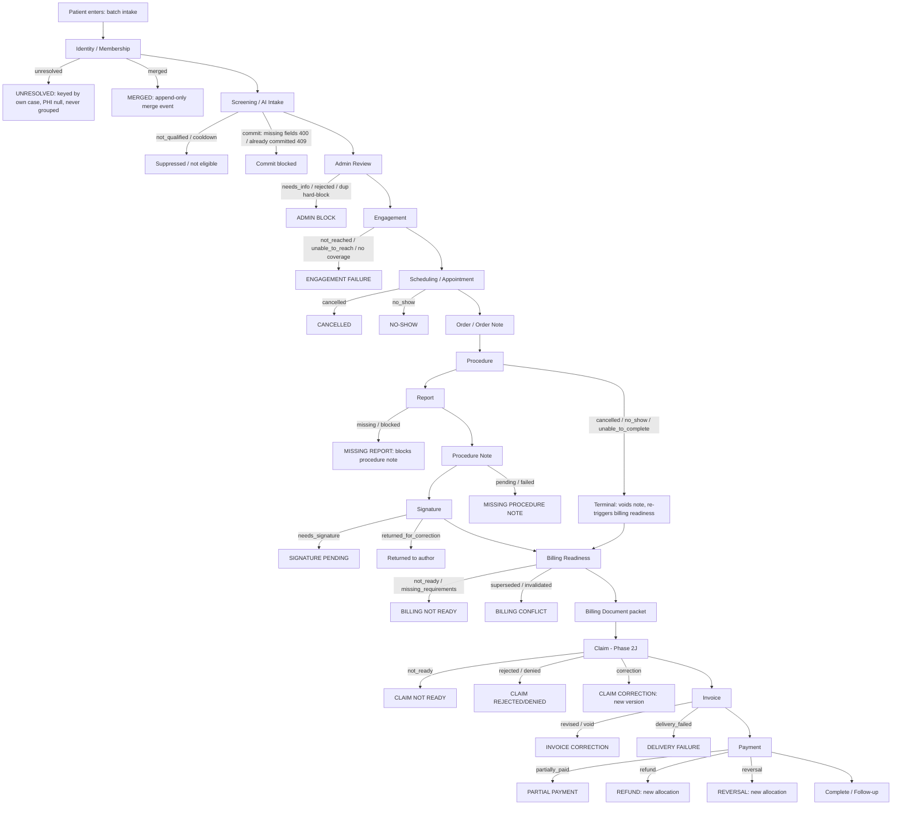

# Phase 2L — Patient Journey Map (Plexus Ancillary Lifecycle)

**Scope:** Documentation-only. READ-ONLY factual mapping of the EXISTING platform at branch `phase/2l-ui-discovery`, HEAD `08a78978`. This is NOT a redesign. Every stage below is derived from and verified against canonical code at this HEAD; nothing is a generic healthcare template. Cells that could not be confirmed from source are marked `UNKNOWN_NEEDS_VERIFICATION`.

**Cross-references (do not contradict):** `PHASE_2L_FUNCTIONAL_FREEZE.md` (status vocabularies, roles, flags), `PHASE_2L_UI_ARCHITECTURE_MAP.md` (surface→DB chains), `PHASE_2L_SURFACE_INVENTORY.md` (surface IDs S001–S361), `PHASE_2L_ROUTE_ROLE_MAP.md` (routes RT001–RT072, guards).

## Authoritative spine

The lifecycle is not invented — it is the **canonical stage vector** at `shared/canonicalStageVector.ts:98-115` (`CANONICAL_STAGE_ORDER`), the server-computed truth rendered read-only by PCS/ACS (`StageVectorView` S219, labels at `client/src/components/careSpecialist/StageVectorView.tsx:12-18`):

```
adminReview → engagement → appointment → orderNote → procedure → report →
procedureNote → signature → billingReadiness → billingDocument →
[claim → invoice → payment]   (last 3 = Phase 2J financial, additive & flag-gated)
```

The vector describes ONE distinct ancillary-case episode (`CaseStageVector`, `canonicalStageVector.ts:65-93`). It is preceded (upstream of `adminReview`) by patient entry, identity/membership, and screening/intake — which are **not** part of the vector because they precede the ancillary case's existence. `deriveCurrentStage` (`server/services/canonicalStage/caseStageVector.ts:658`) picks the **earliest incomplete** stage, or a `conflicting`/`unresolved` integrity state — **never the most-advanced** stage.

**Flag reality at HEAD:** every canonical stage (2A–2J) is gated by an OFF-by-default flag (`server/lib/featureFlags.ts`, 27 flags). So the *rendered runtime* at HEAD is the legacy path + the canonical vector returning a **disabled contract** (`availability:"disabled_flag_off"` / `"upstream_flag_off"`). The canonical semantics below are the **contract to preserve**; the disabled path is the current visible truth.

**Portal columns:** PCS = Patient Care Specialist portal (`PCS_ROLES={admin,liaison}`); ACS = Ancillary Care Specialist portal (`ACS_ROLES={admin,technician}`); Clinician = Physician/Clinician portal (`requireClinicianOrAdmin`); Scheduler-Team = outreach/scheduler + engagement surfaces; Admin = admin-guarded; Finance = billing/invoices desk.

---

## STAGE 0 — PATIENT ENTERS (batch intake)

| Field | Value |
|---|---|
| Canonical object/entity | `patient_screenings`, `screening_batches` (`shared/schema/screening.ts`) |
| Entry condition | User creates a screening batch (date + facility) and adds patients (paste/upload/manual) |
| Exit condition | Patient row exists in a batch with clinical data captured; ready for AI analysis |
| Statuses | `screening_batches.status` default `"processing"` (no enum — free-text); `patient_screenings.status` default `"pending"` (no enum) |
| Exception statuses | Soft-delete / recall handled downstream; `UNKNOWN_NEEDS_VERIFICATION` exhaustive batch status set (no schema enum) |
| Actor/role | Any authenticated (no App.tsx guard on intake routes) — operationally admin/clinician/scheduler |
| Portal | Home / Plexus IQ (not a portal-role surface) |
| UI route | RT005 `/home`, RT033 `/patient-intake`, RT039 `/plexus-iq`, RT035 `/visit-patients` |
| Surface IDs | S011 Home, S025 New Schedule Dialog, S029 Visit Build Pane, S097 Plexus IQ, S104 Add Patient Hub, S105 Add Patient Modal, S106/S106 Bulk Import, S127 Qualification Landing, S129 Visit Build Pane |
| APIs | `POST /api/batches`, `POST /api/batches/:id/patients`, `/import-file`, `/import-text` (`server/routes/batches.ts:55,227,319,425`); `POST /api/screening-batches` (home) |
| Backend service | `server/services/screening.ts`; `server/services/plexusIq/*`; batch persistence via `screening.repo.ts` |
| Canonical read model | `patient_screenings`, `screening_batches` |
| Retry/recovery | None at intake (synchronous create). AI screening (Stage 1) is the async/retry surface |
| Next stage | Identity/Membership (resolution) + Screening/Intake (AI analysis) |
| User-visible blockers | Missing facility/date on batch create; missing required clinical fields surface later at commit |
| Current UI representation | ACTIVE — real backend-wired batch builder and Plexus IQ operating list |

---

## STAGE 1 — IDENTITY / MEMBERSHIP

Two identity models coexist; the global model is **flag-gated OFF** (`FEATURE_PLEXUS_IDENTITY_WRITE`/`_REVIEW`).

| Field | Value |
|---|---|
| Canonical object/entity | **Model A (active):** `patient_directory` (`shared/schema/patientDirectory.ts:31`), `plexus_id` `PLX-000001…` via DB trigger. **Model B (OFF):** `global_plexus_patients`, `patient_clinic_memberships`, `patient_external_identifiers`, `patient_identity_match_candidates`, `patient_identity_merge_events`, `plexus_id_aliases`, `plexus_identity_link_failures` (`shared/schema/plexusIdentity.ts`) |
| Entry condition | A screening/case needs a person identity resolved for its clinic |
| Exit condition | Model A: directory row `active`. Model B: verified **exact active clinic membership** proves PHI (`server/services/pcs/pcsIdentity.ts:36-62`) |
| Statuses | Directory: `PATIENT_DIRECTORY_STATUSES=["active","inactive","merged","deleted"]`. Global: `IDENTITY_STATUSES=["active","possible_duplicate","merged","inactive"]`; `MEMBERSHIP_STATUSES=["active","inactive","withdrawn","merged_away"]`; `MATCH_TIERS=["definitive","high","medium","low"]`; `MATCH_REVIEW_STATUSES=["pending","confirmed","rejected","deferred"]` |
| Exception statuses | Runtime `unresolved` outcome (not a stored column): warning codes `identity_membership_missing`/`_wrong_clinic`/`_inactive`, `identity_patient_membership_conflict`, `identity_global_patient_missing`/`_not_current` (`pcsIdentity.ts`); `identity_incomplete`/`identity_unverified` on the stage vector (`caseStageVector.ts:526`) |
| Actor/role | Resolver (system) + admin match-review (Model B review OFF; `requirePlexusIdentityAccess` **always denies** — no Plexus-internal role in `USER_ROLES`) |
| Portal | Patient EHR / admin bulk-import review |
| UI route | RT016 `/patient-directory` |
| Surface IDs | S071 Bulk Import Dialog (match/preview/approve), S077 Duplicate Warning Badge, S078 Admin Review Duplicate Guard, S076 Patient Audit Trail Modal, S253 Portal Patient Directory Facts Card |
| APIs | `/api/patient-directory/*` (import-preview/confirm, duplicate-warning-facts, search) — gated on `USE_PATIENT_DIRECTORY_ACTIVATION`; identity routes (`server/routes/plexusIdentity.ts`) **NOT registered**; `match-candidates` → 501 |
| Backend service | `server/services/plexusIdentity/resolver.ts` (no-demographic-fallback rule, `:27-32`); `server/services/pcs/pcsIdentity.ts`; `patientDirectoryWriter` |
| Canonical read model | `patient_directory`; (Model B) `patient_clinic_memberships` |
| Retry/recovery | `plexus_identity_link_failures` ledger (Model B, OFF). Merges append-only via `createMergeEvent` (`plexusIdentity.repo.ts:382-393`) — reversal creates a NEW row, never mutates |
| Next stage | Screening/Intake (or directly Admin Review for the ancillary case) |
| User-visible blockers | Duplicate/DNC/cooldown warnings (S077–S079); an `unresolved` case is **never grouped** with another patient (keyed by its own `ancillaryCaseId`) and its display fields are null |
| Current UI representation | Model A: ACTIVE (directory, dup guards). Model B: BACKEND_ONLY + disabled — no live identity-resolution/merge UI surface (routes unregistered, review flag OFF) |

`UNKNOWN_NEEDS_VERIFICATION`: production source-of-truth between `patient_directory` and `global_plexus_patients`.

---

## STAGE 2 — SCREENING / INTAKE (AI qualification)

| Field | Value |
|---|---|
| Canonical object/entity | `patient_screenings` (`shared/schema/screening.ts`) |
| Entry condition | Patient row exists in a batch with clinical data |
| Exit condition | AI screening produces qualifying tests + reasoning; patient becomes `Ready` to commit |
| Statuses | `commit_status` default `"Draft"` → `COMMIT_STATUSES=["Draft","Ready","WithScheduler","Scheduled"]` (`screening.ts:137`); `qualification_status`/`qualification` → `["unscreened","qualified","not_qualified","pending_review"]`; `admin_approval_status` default `"pending"` |
| Exception statuses | `not_qualified`, `pending_review`; cooldown suppression; batch analysis job failure |
| Actor/role | System (OpenAI) + clinician/admin review |
| Portal | Plexus IQ / Home / Clinician |
| UI route | RT039 `/plexus-iq`, RT033 `/patient-intake`, RT037 `/outreach-patients` |
| Surface IDs | S030 Results View, S098 Plexus IQ Workspace, S099–S102 Operating List/Row, S113/S114 Qualification Jobs Status, S115 Recent Qualification Cards, S130 Qualification Patient Cards Pane, S082 Patient Detail Dialog, S192 Qualification Reasoning Dialog |
| APIs | `POST /api/patients/:id/analyze` (`patients.ts:1010`), `/analyze-test` (`:1198`), batch `POST /api/batches/:id/analyze` (`batches.ts:505`); poll `/api/plexus-iq/qualification-jobs/{jobId}` |
| Backend service | `server/services/screening.ts` (`screenSinglePatientWithAI:115`, `checkCooldownsForPatients:192`), `batchAnalysisRunner.ts` (`startBatchAnalysis:244`, `runAnalysisLoop:559`) |
| Canonical read model | `patient_screenings`, `analysis_jobs` |
| Retry/recovery | Batch analysis runs under advisory lock; async job with poll; re-analyze/regenerate available |
| Next stage | Commit → Engagement/Scheduling (via `commitPatient`); Admin Review (canonical vector Stage 3) |
| User-visible blockers | Cooldown window; `not_qualified` result; missing required fields on commit; analysis job failure |
| Current UI representation | ACTIVE — Plexus IQ qualification workspace and results |

**Commit gate (bridge to engagement):** `POST /api/patients/:id/commit` → `commitPatient` (`patients.ts:1106`). Returns **400** with `missing` field list ("Cannot send to schedulers — missing required field(s): …"), **409** "Patient already committed". On success, `commit_status` → `WithScheduler`, and `assignNewlyEligiblePatient` fires the live call-list assignment hook (`patients.ts:~1130`). `scheduler_auto_assign_enabled` default **false** ⇒ case stays in the manual Engagement Center pool.

---

## STAGE 3 — ADMIN REVIEW  (canonical vector stage `adminReview`)

| Field | Value |
|---|---|
| Canonical object/entity | `ancillary_case_admin_review_events` (`shared/schema/adminReviewEvents.ts`), `patient_ancillary_cases.admin_review_status` |
| Entry condition | An ancillary case exists and needs service-specific admin sign-off |
| Exit condition | Review recorded `approved` (case may activate/engage) |
| Statuses | `ANCILLARY_REVIEW_STATUSES=["pending","approved","needs_info","rejected"]` (legacy `"denied"`→`"rejected"`); sources `ANCILLARY_REVIEW_SOURCES=["manual","bulk","same_day_retroactive","reanalysis","migration","system_reconciliation"]`; screening-side `ADMIN_APPROVAL_STATUSES=["pending","approved","needs_info","rejected"]` |
| Exception statuses | `needs_info`, `rejected`; engagement-sync outcomes `activated|restored|already_active|deferred_no_list|deactivated|no_change|skipped_flag_off|failed` (`recordAdminReview.ts:69-77`) |
| Actor/role | admin (client dialogs). Server `requireAdminReviewAccess` **always 403** (no reviewer role yet). Flag `serviceSpecificAdminReview` OFF |
| Portal | Plexus IQ / Qualification |
| UI route | RT039 `/plexus-iq` |
| Surface IDs | S122 Admin Review Dialog, S123 Admin Approval Control, S124 Admin Review AI Logic Drawer, S126 Approval status chip, S078 Admin Review Duplicate Guard, S118 Run Comparison Selector |
| APIs | `POST /api/patient-screenings/:id/admin-approval` (S123); `/api/admin-review-events/*` (`server/routes/adminReviewEvents.ts`); regenerate `POST /api/patient-screenings/:id/admin-review/regenerate(-all)` (`patients.ts:244,282`) |
| Backend service | `server/services/adminReview/{recordAdminReview.ts(:139),bulkAdminReview,screeningProjection,authorization(always 403)}` |
| Canonical read model | `ancillary_case_admin_review_events`, `patient_ancillary_cases`, `patient_screenings` |
| Retry/recovery | Reanalysis/regenerate re-runs review projection; append-only review-event ledger |
| Next stage | Engagement |
| User-visible blockers | Duplicate/DNC/cooldown hard-block on Approve (S078); `needs_info`/`rejected` halt progression |
| Current UI representation | Legacy screening admin-approval ACTIVE (S123). Canonical service-specific admin review = BACKEND_ONLY + disabled (flag OFF, authorization always 403) |

---

## STAGE 4 — ENGAGEMENT  (canonical vector stage `engagement`)

| Field | Value |
|---|---|
| Canonical object/entity | `engagement_lists`, `engagement_list_memberships`, `patient_execution_cases.engagement_status` (`shared/schema/engagement.ts`, `executionCase.ts`) |
| Entry condition | Case approved/committed and eligible for outreach; committed patient enters the pool |
| Exit condition | Case scheduled (or terminal DNC/declined/unable-to-reach) |
| Statuses | `ENGAGEMENT_STATUSES=["new","contacted","scheduled","completed","not_reached","unable_to_reach"]`; `ENGAGEMENT_BUCKETS=["visit","outreach","scheduling_triage"]`; `ENGAGEMENT_TEAMS=["PCS","ACS"]` |
| Exception statuses | `not_reached`, `unable_to_reach`; distribution/reconciliation failures (`engagement_reconciliation_failures`) |
| Actor/role | scheduler (call execution) + admin (distribution/assignment). Engagement distribution/metrics/call-settings `/api/*` are `requireRole("admin")` |
| Portal | Scheduler-Team (Engagement Center, Outreach) + PCS |
| UI route | RT045 `/engagement-center`, RT026 `/scheduler-portal`, RT024 `/outreach/scheduler/:id`, RT043 PCS portal |
| Surface IDs | S167 Engagement Center, S172 Assignment Worklist, S173 Scheduler Picker, S175 Case Detail Panel, S176/S177 Auto-Distribute/Distribution Panel, S154 Call List Panel, S158 Current Call Card, S160 Disposition Sheet, S225 Call Workspace (portal), S125 Change Engagement Assignment |
| APIs | `/api/engagement/assignment-board`(+`/assign`,`/cancel-many`), `/baskets`, `/distribution/{preview,live,apply,member}`, `/team-metrics`, `/call-settings`, `/api/outreach/*`, `/api/outreach/calls` |
| Backend service | `server/services/engagement/{distributionService.ts(buildDistributionPlan:181,applyDistribution:910),basketRules,teamMetricsService,callSettingsService}`; `outreachService.ts`; `callListEngine.ts` |
| Canonical read model | `engagement_lists`, `engagement_list_memberships`, `patient_execution_cases` |
| Retry/recovery | `engagement_reconciliation_failures` ledger; `callListEngine.releaseAndRedistribute`; advisory lock on scheduler assignments |
| Next stage | Scheduling / Appointment |
| User-visible blockers | Uncovered clinics warning (S143); duplicate handoff bar (S079); terminal DNC/declined removes from queue; assignment requires scheduler coverage |
| Current UI representation | ACTIVE — Engagement Center + Outreach Scheduler workspace. Canonical engagement stage view = flag-gated in portals (`engagementAdminReviewSync`, multi-list repository OFF) |

---

## STAGE 5 — SCHEDULING / APPOINTMENT  (canonical vector stage `appointment`)

| Field | Value |
|---|---|
| Canonical object/entity | Canonical appointment lives on `global_schedule_events` (NOT a standalone table); legacy `ancillary_appointments` (`shared/schema/globalSchedule.ts`, `canonicalAppointments.ts`) |
| Entry condition | Case ready to book an ancillary procedure slot |
| Exit condition | Appointment `scheduled` for a qualifying `event_type` |
| Statuses | `CANONICAL_APPOINTMENT_STATUSES=["scheduled","completed","cancelled","no_show","rescheduled"]`; transitions `["complete","cancel","no_show","reschedule"]`. Only `event_type IN ("ancillary_appointment","same_day_add")` qualifies; `doctor_visit` EXCLUDED |
| Exception statuses | `cancelled`, `no_show`, `rescheduled`; scheduling-triage bucket |
| Actor/role | scheduler / PCS / portal roles |
| Portal | Scheduler-Team + Scheduler portal + PCS/ACS scheduling workspace |
| UI route | RT023 `/appointments`, RT024 `/outreach/scheduler/:id`, RT014 `/schedule`, RT069 `/dashboard` |
| Surface IDs | S161 Tri-Clinic Calendar, S162 Booking Dialogs, S193–S198 Appointments Page/Slot Grid/Book/Cancel, S203 Canonical Command Calendar, S206 Canonical Appointment Summary, S226 Scheduling Workspace (portal), S255/S256 Portal quick-schedule |
| APIs | `POST /api/appointments`, PATCH `/api/appointments/{id}`; `/api/global-schedule-events`; `/api/schedule/dashboard` |
| Backend service | `server/services/canonicalAppointments/{scheduleAncillaryOrchestrator,transitionOrchestrator,canonicalAppointmentService}`; `patientCommitService.ensureCanonicalSpineForScreening` |
| Canonical read model | `global_schedule_events` (canonical), `ancillary_appointments` (legacy), `canonical_appointment_reconciliation_failures` |
| Retry/recovery | `canonical_appointment_reconciliation_failures` ledger; reschedule transition |
| Next stage | Order/Order Note |
| User-visible blockers | Duplicate-name booking warning (S162 CONFLICT); slot conflict; PTO/coverage |
| Current UI representation | ACTIVE — legacy appointments/scheduler booking. Canonical appointment orchestrators return `skipped_flag_off` while `canonicalAppointment` OFF (S206 flag-gated) |

---

## STAGE 6 — ORDER / ORDER NOTE  (canonical vector stage `orderNote`)

| Field | Value |
|---|---|
| Canonical object/entity | `procedure_notes` (`doc_kind`=`order_note`) / `ancillary_document_references` (`kind=order_note`) (`shared/schema/notes.ts`, `ancillaryDocuments.ts`) |
| Entry condition | Appointment scheduled; an order note is needed for the procedure |
| Exit condition | Order note created (and signed if required) |
| Statuses | `NOTE_TYPES=["order_note","post_procedure_note"]`; `NOTE_GENERATION_STATUSES=["pending","generating","generated","failed","approved","voided"]`; order-note signature `ORDER_NOTE_SIGNATURE_REQUIREMENTS=["unresolved","required","not_required"]` — "We NEVER auto-sign in Phase 2E-A" (`ancillaryDocuments.ts:63`) |
| Exception statuses | `failed`, `voided`; signature `unresolved` |
| Actor/role | clinician (order/sign) via Clinician portal |
| Portal | Clinician |
| UI route | RT031 `/clinician-portal` |
| Surface IDs | S262 Orders & Notes Workspace, S266 Canonical Orders & Notes Page, S271 Signatures Tab, S279 Canonical Ancillary Documents List |
| APIs | `/api/physician-portal/*` orders/notes create/amend/draft/send-back/sign; `/api/generated-notes`; `/api/ancillary-documents` (flag-gated) |
| Backend service | `server/services/procedureLifecycle/procedureNoteService.ts`, `procedureNoteGenerator.ts`; `services/ancillaryDocuments/documentReferenceWriter` |
| Canonical read model | `procedure_notes`, `generated_notes`, `ancillary_document_references` |
| Retry/recovery | `ancillary_document_reconciliation_failures`; retry worker exact-source binding |
| Next stage | Procedure |
| User-visible blockers | Order note not created/signed; signature requirement `unresolved` |
| Current UI representation | Legacy notes surfaces ACTIVE; canonical Order Note flag-gated OFF (`canonicalOrderNote`) → service returns early |

---

## STAGE 7 — PROCEDURE  (canonical vector stage `procedure`)

| Field | Value |
|---|---|
| Canonical object/entity | `procedure_events` (`shared/schema/procedureEvents.ts`), prerequisites `ancillary_service_prerequisite_config` |
| Entry condition | Order in place; procedure begins |
| Exit condition | Terminal transition (`complete`) |
| Statuses | `PROCEDURE_STATUSES=["not_started","in_progress","paused","complete","cancelled","no_show","unable_to_complete","reschedule_needed"]`; terminal `["complete","cancelled","no_show","unable_to_complete"]` (`reschedule_needed` NOT terminal) |
| Exception statuses | `cancelled`, `no_show`, `unable_to_complete`, `reschedule_needed`, `paused` |
| Actor/role | technician / ACS (execution); clinician oversight |
| Portal | ACS + Clinician |
| UI route | RT029 `/technician-portal`, RT044 ACS portal, RT031 `/clinician-portal` |
| Surface IDs | S096 Procedure Complete Button, S244 Ancillary Doc Modals, S246 Report Upload Panel, S247 ACS Workflow Panel, S248 Ancillary Readiness Row, S219 Stage Vector View (procedure cell) |
| APIs | `POST /api/procedure-events/complete`, `/api/procedure-events` transitions (`server/routes/procedureEvents.ts`) |
| Backend service | `server/services/procedureLifecycle/{procedureStateMachine.ts(:11-16),canonicalProcedureCompletion.ts(completeCanonicalProcedure:252),procedureLifecycleOrchestration,procedurePrerequisites}` |
| Canonical read model | `procedure_events`, `ancillary_service_prerequisite_config` |
| Retry/recovery | Idempotent completion (`complete→complete` allowed); reconciliation-deferred outcomes; terminal rows never reopened |
| Next stage | Report |
| User-visible blockers | `PREREQUISITE_BLOCKER_CATEGORIES` incl `hard_procedure_blocker` at stage `procedure_start`; prerequisite not met |
| Current UI representation | Procedure completion button ACTIVE (legacy). Canonical procedure lifecycle flag-gated OFF (`canonicalProcedureLifecycle`) → hook no-op |

State machine (`procedureStateMachine.ts:11-16`): `not_started→in_progress`; `in_progress↔paused`; `{not_started,in_progress,paused}→cancelled/no_show` (voidsNote); `{in_progress,paused}→unable_to_complete` (voidsNote); `{in_progress,paused}→complete`. Every terminal transition voids current note lineage AND re-triggers billing readiness.

---

## STAGE 8 — REPORT  (canonical vector stage `report`)

| Field | Value |
|---|---|
| Canonical object/entity | `ancillary_document_references` (`kind=report`) / uploaded report doc (`shared/schema/ancillaryDocuments.ts`, `documents.ts`) |
| Entry condition | Procedure complete; interpreting report uploaded/generated |
| Exit condition | Report present (`uploaded`/`generated`), enabling the procedure note |
| Statuses | `ANCILLARY_DOCUMENT_KINDS` incl `"report"`; `ANCILLARY_DOCUMENT_STATUSES=["pending","pending_signature","signed","uploaded","superseded","voided"]`; readiness `DOCUMENT_STATUSES=["missing","pending","uploaded","generated","approved","completed","blocked"]` |
| Exception statuses | `missing`, `blocked`, `superseded` (report replacement) |
| Actor/role | technician/ACS (upload) |
| Portal | ACS |
| UI route | RT044 ACS portal, RT022 `/document-upload`, RT018 `/ancillary-documents` |
| Surface IDs | S246 Report Upload Panel, S272 Reports Tab (clinician), S282/S283 Document Upload, S094 Document Readiness Panel, S279 Canonical Ancillary Documents |
| APIs | `POST /api/documents/upload`, `/api/documents/ocr-name`; `/api/case-document-readiness/complete`; `/api/ancillary-documents` |
| Backend service | `server/services/documents/*`, `blobStore.ts`; `ancillaryDocuments/{documentReferenceWriter,retryWorker}` |
| Canonical read model | `ancillary_document_references`, `case_document_readiness`, `uploaded_documents` |
| Retry/recovery | Report replacement action `reconcile_procedure_note_lineage` (supersede + amend); `ancillary_document_reconciliation_failures` |
| Next stage | Procedure Note |
| User-visible blockers | Report `missing` blocks procedure-note eligibility (2-condition gate); readiness `blocked` |
| Current UI representation | Legacy upload/readiness ACTIVE; canonical unified documents flag-gated OFF (`unifiedAncillaryDocuments`) → zero `/api/ancillary-documents` reads |

---

## STAGE 9 — PROCEDURE NOTE  (canonical vector stage `procedureNote`)

| Field | Value |
|---|---|
| Canonical object/entity | `procedure_notes` (`doc_kind`=`post_procedure_note`) (`shared/schema/notes.ts`) |
| Entry condition | Procedure complete **AND** report present (2-condition eligibility gate, `procedureNoteEligibility.ts`) |
| Exit condition | Note `generated`, awaiting signature |
| Statuses | `NOTE_GENERATION_STATUSES=["pending","generating","generated","failed","approved","voided"]` |
| Exception statuses | `failed`, `voided` (voided by terminal procedure transition or report replacement) |
| Actor/role | System generator + clinician |
| Portal | Clinician |
| UI route | RT031 `/clinician-portal` |
| Surface IDs | S262/S266 Orders & Notes, S271 Signatures Tab |
| APIs | `/api/procedure-notes`; physician-portal note create/amend |
| Backend service | `procedureNoteEligibility.ts` (2-condition gate), `procedureNoteGenerator.ts`, `procedureNoteService.ts`, `procedureNoteLineage.ts` (void/amend) |
| Canonical read model | `procedure_notes` |
| Retry/recovery | `procedureNoteLineage` void/amend; deferred-retry outcomes |
| Next stage | Signature |
| User-visible blockers | Eligibility not met (procedure not complete OR report missing); generation `failed` |
| Current UI representation | BACKEND_ONLY + disabled — composite `procedureNoteRuntimeEnabled()` (lifecycle+note+unifiedDocs) OFF; never auto-signs |

---

## STAGE 10 — SIGNATURE  (canonical vector stage `signature`)

| Field | Value |
|---|---|
| Canonical object/entity | `procedure_notes` signature fields (the ONLY real signature state machine, `shared/schema/generatedNotes.ts:107-135`) |
| Entry condition | Procedure note `generated` and ready to sign |
| Exit condition | Note `signed` (immutable body) |
| Statuses | `SIGNATURE_STATUSES=["needs_signature","ready_to_sign","signed","returned_for_correction"]` + `signedAt`/`signedByUserId`/`returnReason` |
| Exception statuses | `returned_for_correction` (sent back); `needs_signature` (pending) |
| Actor/role | clinician (physician sign) |
| Portal | Clinician |
| UI route | RT031 `/clinician-portal` |
| Surface IDs | S271 Signatures Tab, S245 Signature Pad, S258 Clinician Portal Shell (bulk-sign) |
| APIs | `/api/physician-portal/signature-items`, `/signature-items/bulk-sign` |
| Backend service | Signature stamped **exclusively at repository boundary** (`signProcedureNoteRow`/`returnProcedureNoteRow`) — a client body can NEVER seed signer/signed-at/status |
| Canonical read model | `procedure_notes` |
| Retry/recovery | Report replacement supersedes a signed note and opens a pending amendment (`procedureNoteLineage`); void requires terminal evidence |
| Next stage | Billing Readiness |
| User-visible blockers | `needs_signature`/`returned_for_correction` blocks completion; signed body immutable |
| Current UI representation | Signatures Tab ACTIVE (legacy procedure_notes signature). Canonical procedure-note signature gated by composite flag OFF |

---

## STAGE 11 — BILLING READINESS  (canonical vector stage `billingReadiness`)

| Field | Value |
|---|---|
| Canonical object/entity | `billing_readiness_checks` (`shared/schema/billingReadiness.ts`) |
| Entry condition | Signature complete (or any terminal procedure transition re-triggers readiness) |
| Exit condition | Readiness `ready_to_generate` → `billing_document_generated`/`sent_to_billing` |
| Statuses | `BILLING_READINESS_STATUSES=["not_ready","missing_requirements","ready_to_generate","billing_document_generated","sent_to_billing"]`; canonical `["missing_requirements","ready_to_generate","billing_document_pending","billing_document_generated","superseded","invalidated","migration_missing"]` |
| Exception statuses | `not_ready`, `missing_requirements`, `superseded`, `invalidated`, `migration_missing` |
| Actor/role | admin/biller |
| Portal | Finance |
| UI route | RT056 `/billing/readiness` (AdminGuard) |
| Surface IDs | S295 Billing Readiness Page, S294 Canonical Billing Panel, S094 Document Readiness Panel |
| APIs | `/api/billing-readiness-checks`, `/api/ancillary-cases/:id/billing-readiness(/evaluate)`, `/api/completed-billing-packages` |
| Backend service | `services/billingReadiness/billingReadinessAggregator`; `services/billingLifecycle/billingReadinessEvaluator.ts` (`evaluateCanonicalBillingReadiness`, fail-closed `:198,245,338`) |
| Canonical read model | `billing_readiness_checks`, `case_document_readiness` |
| Retry/recovery | Re-evaluate on terminal procedure transition and on readiness-doc completion; `billingBlockers`/`claimBlockers` code counts |
| Next stage | Billing Document |
| User-visible blockers | `PREREQUISITE_BLOCKER_CATEGORIES` `billing_blocker`; missing documents; `missing_requirements` |
| Current UI representation | Legacy readiness ACTIVE (S295). Canonical `billingReadinessRuntimeEnabled()` composite OFF → zero migration-0055 reads/writes |

---

## STAGE 12 — BILLING DOCUMENT  (canonical vector stage `billingDocument`)

| Field | Value |
|---|---|
| Canonical object/entity | `billing_document_requests` (`shared/schema/billingDocuments.ts`) — an **operational packet, NOT a claim/invoice/payment** |
| Entry condition | Billing readiness `ready_to_generate` |
| Exit condition | Packet `generated`/`sent_to_billing` |
| Statuses | request `["pending","generating","generated","failed","sent_to_billing"]`; canonical `["pending","generating","generated","approved","failed","superseded","voided"]` |
| Exception statuses | `failed`, `superseded`, `voided` |
| Actor/role | admin/biller (system generator) |
| Portal | Finance |
| UI route | RT056 `/billing/readiness`, RT020 `/billing` |
| Surface IDs | S294 Canonical Billing Panel |
| APIs | `/api/billing-document-requests`, `/:id`; `/api/ancillary-cases/:id/billing-document(/generate)` |
| Backend service | `services/billingLifecycle/{billingLifecycleOrchestration,billingDocumentGenerator,billingRetryHandlers}` (`ensureCanonicalBillingDocumentForAncillaryCase`) |
| Canonical read model | `billing_document_requests` (legacy+canonical statuses on same physical table, migration 0055) |
| Retry/recovery | `billingRetryHandlers`; supersede action `supersede_billing_document` |
| Next stage | Claim (Phase 2J financial) |
| User-visible blockers | Generation `failed`; superseded packet |
| Current UI representation | BACKEND_ONLY + disabled — `billingDocumentRuntimeEnabled()` OFF (`canonicalBillingDocument`); no dedicated UI beyond the pipeline panel S294 |

---

## STAGE 13 — CLAIM  (Phase 2J financial, flag-gated)

| Field | Value |
|---|---|
| Canonical object/entity | `canonical_claims` (`shared/schema/canonicalClaims.ts`); NO repository (direct `db` in `canonicalFinancial/*`) |
| Entry condition | Built from the **EXACT current Billing Document evidence version** |
| Exit condition | Claim `submitted`/`accepted`/`paid` |
| Statuses | `CANONICAL_CLAIM_STATUSES=["not_ready","ready","draft","queued","submitted","accepted","rejected","denied","partially_paid","paid","voided","superseded"]` |
| Exception statuses | `not_ready`, `rejected`, `denied`, `voided`, `superseded` |
| Actor/role | biller/admin (finance role) |
| Portal | Finance / Clinician (canonical finance) |
| UI route | RT031 `/clinician-portal` (canonical finance), Finance desk |
| Surface IDs | S265 Canonical Finance Page, S268 Canonical Financial Ledger Panel, S303 Invoice Review (legacy claim-view), S270 Finance Tab Disabled |
| APIs | `/api/ancillary-cases/:id/canonical-claim-readiness`, `POST /api/ancillary-cases/:id/canonical-claim`, `POST /api/canonical-claims/:id/{transition,correction,canonical-invoice}` |
| Backend service | `services/canonicalFinancial/{claimCommands,claimReadiness,stateMachines,commandSupport,lineageValidators}` |
| Canonical read model | `canonical_claims`, `canonical_financial_transitions` |
| Retry/recovery | Corrections create new versioned rows; one `canonical_financial_transitions` audit row per command (idempotencyKey+commandFingerprint); `canonicalClaimTransmission` present-but-inert (NO transmission adapter exists) |
| Next stage | Invoice |
| User-visible blockers | `not_ready` claim readiness; `CANONICAL_CLAIM_STATUSES` `rejected`/`denied`; finance access restricted (S270) |
| Current UI representation | BACKEND_ONLY + disabled — `canonicalClaimsRuntimeEnabled()` OFF; legacy invoice desk untouched |

---

## STAGE 14 — INVOICE  (Phase 2J financial, flag-gated; PLUS active legacy Phase-4 desk)

| Field | Value |
|---|---|
| Canonical object/entity | `canonical_invoices` (canonical, OFF, no repo); **active legacy** `invoices` + line items/payments/readiness (`shared/schema/invoices.ts`, separate stack — canonical 2J "never reads or rewrites" it) |
| Entry condition | Canonical: derives from a claim. Legacy: created from billing records |
| Exit condition | Invoice `issued`/`delivered`/`paid` |
| Statuses | canonical `CANONICAL_INVOICE_STATUSES=["draft","approved","issued","delivered","partially_paid","paid","voided","superseded","delivery_failed"]`; legacy `INVOICE_STATUSES=["Draft","Sent","Partially Paid","Paid"]`, `INVOICE_APPROVAL_STATUSES=["draft","pending_review","approved","voided","revised"]` |
| Exception statuses | `voided`, `superseded`, `delivery_failed`; legacy `revised`, `pending_review` |
| Actor/role | biller (`/invoices` RoleGuard {admin,biller}); admin (batches/review/delivery) |
| Portal | Finance |
| UI route | RT021 `/invoices` (RoleGuard), RT057 `/billing/invoice-batches`, RT058 `/billing/invoice-review`, RT059 `/billing/invoice-delivery` (AdminGuard) |
| Surface IDs | S297–S301 Invoices page/list/detail/create, S302 Invoice Batches, S303 Invoice Review, S304 Void Dialog, S305/S306 Invoice Delivery, S307 Invoice Financial Panel |
| APIs | `/api/invoices`(+`/aging`,`/:id`,`/:id/status`,`/:id/payments`,`/send-email`), approval `/{approve,revise,submit-for-review,void}`; `/api/invoice-batches`, `/api/invoice-delivery-queue`; canonical `POST /api/canonical-invoices/:id/{transition,correction}` |
| Backend service | legacy `services/billing/{invoiceApprovalService,invoiceDraftService,invoiceFinancialService,invoiceBatchBuilder,invoiceDeliveryService}`; canonical `canonicalFinancial/invoiceCommands` |
| Canonical read model | legacy `invoices`, `invoice_line_items`, `invoice_readiness_snapshots`; canonical `canonical_invoices` |
| Retry/recovery | legacy void requires reason (stamps `voidedAt`/`voidReason`); delivery events/reminders; canonical correction = new versioned row |
| Next stage | Payment |
| User-visible blockers | `INVOICE_READINESS_BLOCKERS` (17); void; `delivery_failed`; not-approved gate on delivery |
| Current UI representation | Legacy invoice desk ACTIVE (S297–S307). Canonical invoices flag-gated OFF |

---

## STAGE 15 — PAYMENT  (Phase 2J financial, flag-gated; PLUS active legacy Phase-4 payments)

| Field | Value |
|---|---|
| Canonical object/entity | `canonical_payments`, `canonical_payment_allocations` (append-only, no repo, no `updated_at`); **active legacy** `invoice_payments`, `invoice_adjustments`, `invoice_denials`, `remittance_events` |
| Entry condition | Invoice issued; payment received/imported |
| Exit condition | Payment `posted` (collected); balance derived from ledger |
| Statuses | `CANONICAL_PAYMENT_EVENT_TYPES=["payment","refund","reversal","adjustment"]`; `CANONICAL_PAYMENT_STATUSES=["pending","imported","posted","reversed","failed"]` — only `"payment"` counts as collected; allocations `CANONICAL_ALLOCATION_EVENT_TYPES=["apply","refund","reversal","adjustment"]` |
| Exception statuses | `reversed`, `failed`; refund/reversal allocations |
| Actor/role | biller/admin (finance role) |
| Portal | Finance / Clinician canonical ledger |
| UI route | RT021 `/invoices`, RT031 `/clinician-portal` (ledger), remittance audit |
| Surface IDs | S307 Invoice Financial Panel (payment/adjustment/denial/remittance forms), S268 Canonical Financial Ledger Panel, S327 Remittance Audit |
| APIs | legacy `POST /api/invoices/:id/payments`, invoice financial-event endpoints; canonical `POST /api/canonical-payments`, `/:id/allocations`, `/:id/refund`, `/:id/reverse` |
| Backend service | legacy `services/billing/invoiceFinancialService` (forward payments only, no refund/reversal); canonical `canonicalFinancial/{paymentCommands,allocationLineage,balance}` |
| Canonical read model | `canonical_payments`, `canonical_payment_allocations`, `canonical_financial_transitions` |
| Retry/recovery | canonical negation under `pg_advisory_xact_lock` on `(clinicId,paymentId)`+`(target)`, **fails closed** (must affect EXACTLY ONE row); lineage `validateNegationLineage` (`exceeds_original`/`already_reversed`) |
| Next stage | Refund/Reversal (when applicable); else Complete |
| User-visible blockers | `partially_paid`; failed import; `SUPPORTED_CURRENCIES={"USD"}` only |
| Current UI representation | Legacy payments/adjustments/remittance ACTIVE (S307). Canonical payments flag-gated OFF |

---

## STAGE 16 — REFUND / REVERSAL (when applicable)  — BACKEND_ONLY (canonical)

| Field | Value |
|---|---|
| Canonical object/entity | NEW `canonical_payment_allocations` row (`eventType ∈ {refund,reversal}`) naming an exact parent `apply` via `parentAllocationId` — originals never mutated (`canonicalPayments.ts:2-4`, `canonicalPaymentAllocations.ts:17-19`) |
| Entry condition | A posted payment must be negated (refund) or reversed |
| Exit condition | Append-only negation row written; balance re-derived (`net = paid − refunded − reversed`) |
| Statuses | allocation `refund`/`reversal`; payment-level `reversesPaymentId` + status `reversed` |
| Exception statuses | lineage failures `exceeds_original`, `already_reversed` |
| Actor/role | biller/admin (finance role) |
| Portal | Finance (canonical, flag-gated) |
| UI route | none dedicated (canonical, OFF) — legacy adjustments via S307 |
| Surface IDs | BACKEND_ONLY for canonical negation; legacy write-offs/adjustments via S307 Invoice Financial Panel |
| APIs | `POST /api/canonical-payments/:id/refund`, `/reverse` |
| Backend service | `paymentCommands.negateAllocation` (`refundCanonicalPayment`/`reverseCanonicalPayment`) under advisory lock; `allocationLineage.validateNegationLineage:74-95` |
| Canonical read model | `canonical_payment_allocations`, `canonical_financial_transitions` |
| Retry/recovery | idempotent (same key+fingerprint); balances derived, never stored |
| Next stage | Complete/Follow-up |
| User-visible blockers | lineage guard (cumulative negation ≤ parent applied) |
| Current UI representation | BACKEND_ONLY + disabled (`canonicalPayments` OFF). `UNKNOWN_NEEDS_VERIFICATION`: business distinction refund vs reversal (code treats both as identical negations); `adjustment` eventType has no command path |

---

## STAGE 17 — COMPLETE / FOLLOW-UP

| Field | Value |
|---|---|
| Canonical object/entity | Terminal `lifecycle_status` on `patient_ancillary_cases`/`patient_execution_cases`; completed packet `completed_billing_packages` |
| Entry condition | All prior stages resolved; case closed or paid |
| Exit condition | Case `closed`/`completed`/`archived` |
| Statuses | `ANCILLARY_LIFECYCLE_STATUSES=["new","active","on_hold","closed","cancelled","archived"]`; execution `LIFECYCLE_STATUSES=["active","completed","archived","cancelled"]`; packages `PAYMENT_STATUSES=["not_received","pending","updated","disputed","reversed"]` |
| Exception statuses | `on_hold`, `cancelled`, `disputed` |
| Actor/role | admin/biller; PCS/ACS view |
| Portal | Finance / PCS / ACS / Clinician |
| UI route | RT056 `/billing/readiness`, portal case views |
| Surface IDs | S294 Canonical Billing Panel (paid/missing-docs sections), S219 Stage Vector (terminal), S095 Patient Journey Drawer |
| APIs | `/api/completed-billing-packages`, `/api/billing/complete-package-payment`, `/api/patient-journey-events` |
| Backend service | `completedBillingPackages` repo/service; `services/journey/appendJourneyEvent` |
| Canonical read model | `completed_billing_packages`, `patient_journey_events` |
| Retry/recovery | Follow-up re-entry (queue re-entry admin setting default true) |
| Next stage | Terminal (or re-entry for a new episode) |
| User-visible blockers | `disputed`; outstanding balance keeps case open |
| Current UI representation | ACTIVE — completed-package payment + journey drawer |

---

## Stage-count summary

- **18 journey stages** captured (Stage 0 through Stage 17).
- **BACKEND_ONLY (no dedicated live UI surface at HEAD):** Stage 1 Model B identity/merge (routes unregistered), Stage 9 Procedure Note (composite flag OFF, no live surface), Stage 12 Billing Document (only pipeline panel S294), Stage 13 Claim (canonical, disabled), Stage 16 Refund/Reversal (canonical negation, disabled). ⇒ **5 stages effectively BACKEND_ONLY** in canonical form (their legacy equivalents, where present, are surfaced).

---

## ALTERNATIVE / EXCEPTION PATHS

| Exception | Trigger condition | Status/state | Actor | Surface | Code evidence |
|---|---|---|---|---|---|
| UNRESOLVED IDENTITY | PHI cannot resolve via a verified exact active clinic membership | runtime `unresolved`; display null; case keyed by own `ancillaryCaseId`, never grouped | system/scheduler view | S077, S219 (identity cell) | `server/services/pcs/pcsIdentity.ts:36-62`; `caseStageVector.ts:526` (`identity_incomplete`/`_unverified`) |
| MERGED IDENTITY | Two records merged | append-only `patient_identity_merge_events`; reversal = NEW row; old Plexus ID in `plexus_id_aliases` | admin (OFF) | BACKEND_ONLY (review flag OFF) | `plexusIdentity.repo.ts:382-393`; `plexusIdentity.ts:310-312` |
| ADMIN BLOCK | Duplicate/DNC/cooldown at approval, or review `needs_info`/`rejected` | Approve hard-blocked; case not activated | admin | S078 Admin Review Duplicate Guard, S123 | `/api/patient-directory/duplicate-warning-facts`; `recordAdminReview.ts` |
| ENGAGEMENT FAILURE | Distribution/reconciliation error, or `not_reached`/`unable_to_reach` | `engagement_reconciliation_failures`; execution `engagement_status` terminal | scheduler/admin | S143 Uncovered Clinics Warning, S154, S172 | `engagement/distributionService.ts`; `executionCase.ts` `ENGAGEMENT_STATUSES` |
| NO-SHOW | Patient does not attend | procedure `no_show` (terminal, voidsNote); appointment `no_show` | technician/scheduler | S096, S162, S206 | `procedureStateMachine.ts:11-16`; `CANONICAL_APPOINTMENT_STATUSES` |
| CANCELLED PROCEDURE | Procedure cancelled | procedure `cancelled` (terminal, voidsNote); appointment `cancelled` | technician/scheduler | S096, S162 | `procedureStateMachine.ts` |
| PROCEDURE UNABLE TO COMPLETE | Started but cannot finish | procedure `unable_to_complete` (terminal from `{in_progress,paused}`, voidsNote) | technician | S096 | `procedureStateMachine.ts:11-16` |
| MISSING REPORT | Procedure complete but no report | readiness `missing`/`blocked`; procedure-note eligibility fails | ACS/technician | S094, S246, S272 | `procedureNoteEligibility.ts` (2-condition gate); `DOCUMENT_STATUSES` |
| MISSING PROCEDURE NOTE | Report present but note not generated | note `pending`/`failed`; `completed_waiting_for_report` | system/clinician | S262/S266 | `canonicalProcedureCompletion.ts:73-97` |
| SIGNATURE PENDING | Note generated, not signed | `needs_signature`/`ready_to_sign` | clinician | S271, S245 | `SIGNATURE_STATUSES` (`generatedNotes.ts`) |
| SIGNATURE RETURNED | Signer sends note back | `returned_for_correction` + `returnReason` | clinician | S271 | `returnProcedureNoteRow` (`generatedNotes.ts:107-135`) |
| BILLING NOT READY | Requirements missing after signature | `not_ready`/`missing_requirements` | admin/biller | S295, S294 | `BILLING_READINESS_STATUSES`; `billingReadinessEvaluator.ts` |
| BILLING CONFLICT | Readiness superseded/invalidated | `superseded`/`invalidated`/`migration_missing` | admin/biller | S294, S219 | canonical `billingReadiness` statuses (`billingReadiness.ts:10-31`) |
| CLAIM NOT READY | Claim readiness fails | `not_ready` | biller | S265 (disabled) | `claimReadiness.ts`; `CANONICAL_CLAIM_STATUSES` |
| CLAIM CORRECTION | Claim needs correction | new versioned row; `canonical_financial_transitions` | biller | BACKEND_ONLY (canonical) | `POST /api/canonical-claims/:id/correction`; `claimCommands` |
| CLAIM REJECTED/DENIED | Payer rejects/denies | `rejected`/`denied` | biller | S303 (legacy denials); S307 | `CANONICAL_CLAIM_STATUSES`; legacy `invoice_denials` `["open","appealed","overturned","upheld","closed"]` |
| INVOICE CORRECTION | Invoice revised/corrected | legacy `revised`; canonical new versioned row | biller/admin | S303/S304 (legacy revise/void); BACKEND_ONLY (canonical) | `invoiceApprovalService`; `POST /api/canonical-invoices/:id/correction` |
| INVOICE DELIVERY FAILURE | Delivery fails | `delivery_failed`; `invoice_delivery_events` | admin | S305/S306 | `CANONICAL_INVOICE_STATUSES`; `invoiceDeliveryService` |
| PARTIAL PAYMENT | Payment < balance | `partially_paid`; balance = charges − (paid+adjusted) | biller | S307, S300 | legacy `invoiceFinancialService`; `INVOICE_STATUSES` `"Partially Paid"` |
| REFUND | Posted payment refunded | NEW allocation `eventType=refund` w/ `parentAllocationId` | biller | BACKEND_ONLY (canonical); legacy write-off via S307 | `refundCanonicalPayment`; `allocationLineage:74-95` |
| REVERSAL | Payment reversed | allocation `eventType=reversal` OR payment-level `reversesPaymentId`+`reversed` | biller | BACKEND_ONLY (canonical) | `reverseCanonicalPayment`; `canonicalPayments.ts` |

`UNKNOWN_NEEDS_VERIFICATION`: precedence of payment-level `reversesPaymentId` vs allocation-level negation; whether canonical Billing Documents require signing.

---

## Happy path + major exception branches (Mermaid)



**Canonical-flag caveat:** all stages from Admin Review onward render as a **disabled contract** in the canonical vector at HEAD (flags OFF); the legacy operational surfaces named above are what a user actually sees today.
