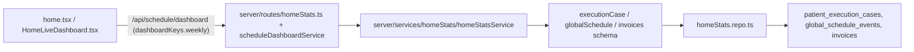
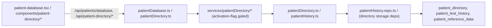
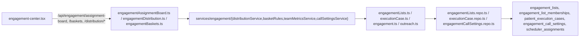
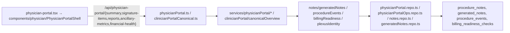

# PHASE 2L UI ARCHITECTURE MAP — Surface → DB Chains

**Scope:** Documentation-only, READ-ONLY factual mapping at HEAD `08a78978` (branch `phase/2l-ui-discovery`).
**Chain modeled per domain:** `SURFACE (page/component)` → `CLIENT QUERY/MUTATION (query key / apiRequest)` → `API ROUTE (server/routes/*)` → `SERVICE (server/services/*)` → `CANONICAL / READ MODEL (shared/schema/*)` → `REPOSITORY (server/repositories/*)` → `DB TABLE`.

**Structural facts established once (referenced throughout):**
- **Routing:** all client routes in `client/src/App.tsx` (wouter `<Switch>`). Query keys centralized in `client/src/hooks/api/keys.ts`; API path libs in `client/src/lib/*Api.ts` and `client/src/lib/workflow/*`.
- **API client:** `client/src/lib/queryClient.ts` → `apiRequest(method,url,data?)` with `credentials:"include"`; 401 handled centrally.
- **Repository layer:** `server/repositories/*.repo.ts` (façade re-exported via `server/storage.ts`).
- **Canonical appointments are NOT a standalone table** — canonical ancillary appointments live on `global_schedule_events` (`shared/schema/globalSchedule.ts`); `shared/schema/canonicalAppointments.ts` holds domain types + a reconciliation-failure ledger only.
- **Canonical claims/invoices/payments have NO repository** — they are persisted directly via `db` inside `server/services/canonicalFinancial/*` (append-only, transaction-scoped).
- Canonical stages (Phase 2A–2J) are flag-gated OFF (see FUNCTIONAL_FREEZE §8); the chains below describe the wiring, which returns a disabled contract when the flag is OFF.

---

## Domain: Home

| UI surface | Client key | Route file+path | Service | Schema/read-model | Repository | DB table |
|---|---|---|---|---|---|---|
| `pages/home.tsx`, `components/HomeLiveDashboard.tsx` | `/api/schedule/dashboard` | `homeStats.ts`; `scheduleDashboardService` | `services/homeStats/homeStatsService`, `scheduleDashboardService.ts` | `executionCase.ts`, `globalSchedule.ts`, `invoices.ts` | `homeStats.repo.ts` | `patient_execution_cases`, `global_schedule_events`, `invoices` |

`pages/home-preview.tsx` is backend-connected (real screening-batches/test-history/dashboard/outreach hooks), NOT a mock.

---

## Domain: Mission Control

| UI surface | Client key | Route file+path | Service | Schema/read-model | Repository | DB table |
|---|---|---|---|---|---|---|
| `pages/mission-control.tsx`, `components/canonical/*` | `/api/mission-control/spine`, `/api/plexus/patients/search` | `missionControl.ts` (`registerMissionControlRoutes(app, requireRole)`) | `services/missionControl/missionControlService` (`buildMissionControlSpine`) | `analysisJobs.ts`, `billingReadiness.ts`, `documentReadiness.ts`, `executionCase.ts` | `missionControl.repo.ts` | `analysis_jobs`, `billing_readiness_checks`, `case_document_readiness`, `patient_execution_cases` |

Gate: `requireRole("admin")`.

---

## Domain: Patient EHR / Patient Directory

| UI surface | Client key | Route file+path | Service | Schema/read-model | Repository | DB table |
|---|---|---|---|---|---|---|
| `pages/patient-database.tsx` | `/api/patients/database`, `/database/cooldown-summary`, `/database/resolve`, `/api/test-history`, `/api/test-history/import` | `patientDatabase.ts`, `testHistory.ts` | `services/patientDirectory/*` | `patientDirectory.ts`, `patientHistory.ts`, `cooldown.ts` | `patientHistory.repo.ts`, `cooldown.repo.ts` | `patient_directory`, `patient_test_history`, `patient_reference_data`, `cooldown_records` |
| `components/patient-directory/*` (+ `lib/patientDirectoryApi.ts`) | `/api/patient-directory`, `/:id`, `/:id/{audit,contact-restrictions,cooldown,events,prior-tests}`, `/duplicate-warning-facts`, `/import-{preview,confirm,batches}`, `/search` | `patientDirectory.ts`, `patientDirectorySectionAccess.ts` (gated on `USE_PATIENT_DIRECTORY_ACTIVATION`) | `services/patientDirectory/patientDirectoryWriter`, `...StorageDeps`, `...ActivationFlag` | `patientDirectory.ts` | (directory storage deps) | `patient_directory` |
| `pages/patient-references.tsx` surface / import | `/api/patient-references` | `patientReferences.ts` | — | `patientHistory.ts` | `screening.repo.ts` | `patient_reference_data` |

Activation flag `USE_PATIENT_DIRECTORY_ACTIVATION` default OFF gates Patient EHR route registration.

---

## Domain: Plexus IQ

| UI surface | Client key | Route file+path | Service | Schema/read-model | Repository | DB table |
|---|---|---|---|---|---|---|
| `pages/plexus-iq.tsx` (**hybrid** — backend + localStorage active-jobs mirror) | `/api/screening-batches`, `/screening-batches/calendar-summary`, `/api/global-schedule-events` | `batches.ts`, `globalSchedule.ts`, `plexusIqClinicalImport.ts` | `services/plexusIq/*`, `plexusIqAiBatch.ts`, `plexusIqPreCheck.ts`, `batchAnalysisRunner.ts` | `screening.ts`, `globalSchedule.ts`, `analysisJobs.ts` | `screening.repo.ts`, `globalSchedule.repo.ts`, `analysisJobs.repo.ts` | `patient_screenings`, `screening_batches`, `global_schedule_events`, `analysis_jobs` |
| `pages/plexus-iq-prototype.tsx` | — (none) | — | — | — | — | **NONE — pure prototype (mock + localStorage, zero `/api/`)** |

---

## Domain: Admin Review

| UI surface | Client key | Route file+path | Service | Schema/read-model | Repository | DB table |
|---|---|---|---|---|---|---|
| `components/patient-directory/AdminReviewDuplicateGuard.tsx` (no dedicated page) | `/api/patient-directory/duplicate-warning-facts`; review writes via `/api/admin-review-events/*` | `adminReviewEvents.ts` | `services/adminReview/{recordAdminReview,bulkAdminReview,screeningProjection,authorization}` (auth **always 403**) | `adminReviewEvents.ts`, `ancillaryCases.ts`, `screening.ts` | `adminReviewEvents.repo.ts`, `ancillaryCases.repo.ts` | `ancillary_case_admin_review_events`, `patient_ancillary_cases`, `patient_screenings` |

Gate: `requireAdminReviewAccess` (no Plexus-internal reviewer role exists → denied). Flag `serviceSpecificAdminReview` default OFF.

---

## Domain: Engagement

| UI surface | Client key | Route file+path | Service | Schema/read-model | Repository | DB table |
|---|---|---|---|---|---|---|
| `pages/engagement-center.tsx` | `/api/engagement/assignment-board` (+`/assign`,`/cancel-many`), `/api/engagement/baskets`, `/api/engagement/distribution/{preview,live,stream,member,apply}`, `/api/engagement/team-metrics`, `/api/engagement/call-settings`, `/api/outreach/schedulers` | `engagementAssignmentBoard.ts`, `engagementDistribution.ts`, `engagementBaskets.ts`, `engagementTeamMetrics.ts`, `engagementCallSettings.ts`, `engagementRepository.ts` | `services/engagement/*` | `engagementLists.ts`, `executionCase.ts`, `engagement.ts`, `outreach.ts` | `engagementLists.repo.ts`, `executionCase.repo.ts`, `engagementCallSettings.repo.ts`, `schedulerAssignments.repo.ts` | `engagement_lists`, `engagement_list_memberships`, `engagement_reconciliation_failures`, `patient_execution_cases`, `engagement_call_settings`, `scheduler_assignments` |

Client flags: `VITE_FEATURE_ENGAGEMENT_MULTI_LIST_REPOSITORY`, `VITE_FEATURE_ENGAGEMENT_RECENT_LISTS` (default OFF → tab "pool", repository tab hidden).

---

## Domain: Scheduler / Team Portal

| UI surface | Client key | Route file+path | Service | Schema/read-model | Repository | DB table |
|---|---|---|---|---|---|---|
| `pages/schedule-dashboard.tsx`, `pages/SchedulePage.tsx` | `/api/schedule/dashboard`, `/api/outreach/schedulers`, `/api/screening-batches` | `globalSchedule.ts`, `schedulerAssignments.ts`, `outreach.ts` | `scheduleDashboardService.ts`, `callListEngine.ts` (`buildDailyAssignments`, `releaseAndRedistribute`), `schedulerAssignmentService.ts`, `schedulerAutoAssign.ts` | `globalSchedule.ts`, `outreach.ts`, `screening.ts` | `globalSchedule.repo.ts`, `schedulerAssignments.repo.ts` | `global_schedule_events`, `scheduler_assignments`, `outreach_schedulers`, `outreach_calls` |
| `pages/appointments.tsx` | `/api/appointments`, `/api/outreach/dashboard` | `appointments.ts` | `services/canonicalAppointments/scheduleAncillaryOrchestrator`, `patientCommitService` (`ensureCanonicalSpineForScreening`) | `appointments.ts`, `canonicalAppointments.ts`, `globalSchedule.ts` | `appointments.repo.ts`, `canonicalAppointments.repo.ts` | `ancillary_appointments`, `global_schedule_events` (canonical), `canonical_appointment_reconciliation_failures` |
| `pages/shared-schedule.tsx` (`/schedule/:id`, outside shell) | `/api/screening-batches` | `batches.ts` | — | `screening.ts` | `screening.repo.ts` | `patient_screenings`, `screening_batches` |
| `pages/team-member-portals.tsx` (landing) | — (static links) | — | — | — | — | none |
| `pages/outreach-scheduler-portal.tsx` (`/outreach/scheduler/:id`) | `/api/scheduler-portal/cases`, `/call-list/recall`, appointment/plexus/outreach hooks | `outreach.ts`, `schedulerAssignments.ts` | `outreachService.ts`, `callListEngine.ts` | `outreach.ts` | `schedulerAssignments.repo.ts`, `outreach.repo.ts` | `scheduler_assignments`, `outreach_calls`, `outreach_schedulers` |

Assignment toggle `assignment.scheduler_auto_assign_enabled` (admin_settings) default OFF → fully manual distribution.

---

## Domain: PCS (Patient Care Specialist)

| UI surface | Client key | Route file+path | Service | Schema/read-model | Repository | DB table |
|---|---|---|---|---|---|---|
| `pages/patient-care-specialist-portal.tsx` → `components/workflow/ClinicWorkflowPortal.tsx` + `components/portal/*` | `/api/portal/widgets`, `/api/portal/workspace-prefs`, `/api/pcs/canonical-view` (flag-gated), + Clinic Workflow surface (`/api/portal/*`, `/api/engagement-center/cases`, `/api/case-document-readiness`, …) | `portalWidgets.ts`, `portalPrefs.ts`, `pcsAcsCanonical.ts` | `services/pcs/{pcsCanonicalView,pcsIdentity}` (`getPcsCanonicalView`), `teamMemberScope.ts` | `portalWidgets.ts`, `portalPrefs.ts`, `plexusIdentity.ts`, `executionCase.ts` | `portalWidgets.repo.ts`, `portalPrefs.repo.ts`, `plexusIdentity.repo.ts` | `portal_widgets`, `workspace_prefs`, `patient_clinic_memberships`, `patient_execution_cases` |

Gate: `PCS_ROLES={admin,liaison}`. Flag `pcsCanonicalView` default OFF → disabled contract.

---

## Domain: ACS (Ancillary Care Specialist)

| UI surface | Client key | Route file+path | Service | Schema/read-model | Repository | DB table |
|---|---|---|---|---|---|---|
| `pages/ancillary-care-specialist-portal.tsx` → `ClinicWorkflowPortal` | `/api/portal/widgets`, `/api/portal/workspace-prefs`, `/api/acs/canonical-view` (flag-gated), Clinic Workflow surface | `portalWidgets.ts`, `portalPrefs.ts`, `pcsAcsCanonical.ts`, `acsWorkflow.ts` | `services/acs/acsCanonicalView` (`getAcsCanonicalView`), `services/ancillary/acsWorkflowRuntime` (`getAcsWorkflowSnapshot`) | `portalWidgets.ts`, `portalPrefs.ts`, `ancillaryCases.ts` | `portalWidgets.repo.ts`, `portalPrefs.repo.ts`, `ancillaryCases.repo.ts` | `portal_widgets`, `workspace_prefs`, `patient_ancillary_cases` |

Gate: `ACS_ROLES={admin,technician}`. Flag `acsCanonicalView` default OFF.

---

## Domain: Clinician Portal (Physician)

| UI surface | Client key | Route file+path | Service | Schema/read-model | Repository | DB table |
|---|---|---|---|---|---|---|
| `pages/physician-portal.tsx` + `components/physician/*` | `/api/physician-portal/{summary,signature-items,signature-items/bulk-sign,reports,ancillary-metrics,financial-health}`; canonical overview via `clinicianPortalCanonical`; orders/notes POST create/amend/draft/send-back/sign | `physicianPortal.ts`, `clinicianPortalCanonical.ts`, `clinicianPortalGuard.ts`, `generatedNotes.ts` | `services/physicianPortal/*`, `services/clinicianPortal/canonicalOverview` (`getClinicianPortalCanonicalOverview`) | `notes.ts`, `generatedNotes.ts`, `procedureEvents.ts`, `billingReadiness.ts` | `physicianPortal.repo.ts`, `physicianPortalOps.repo.ts`, `notes.repo.ts`, `generatedNotes.repo.ts` | `procedure_notes`, `generated_notes`, `procedure_events`, `billing_readiness_checks` |

Gate: `requireClinicianOrAdmin` (fails closed). Flag `clinicianPortalCanonicalData` default OFF → disabled contract.

---

## Domain: Procedure Lifecycle

| UI surface | Client key | Route file+path | Service | Schema/read-model | Repository | DB table |
|---|---|---|---|---|---|---|
| Physician/portal surfaces + `/api/procedure-events/complete` | `/api/procedure-events`, `/complete`; `/api/procedure-notes` | `procedureEvents.ts`, `generatedNotes.ts` | `services/procedureLifecycle/{procedureStateMachine,canonicalProcedureCompletion,procedureLifecycleOrchestration,procedureNoteEligibility,procedureNoteGenerator,procedureNoteService,procedureNoteLineage,procedurePrerequisites}`, `services/procedureEvents/procedureCalendarSyncRules` | `procedureEvents.ts`, `procedurePrerequisites.ts`, `notes.ts`, `generatedNotes.ts` | `procedureEvents.repo.ts`, `procedurePrerequisites.repo.ts`, `notes.repo.ts`, `generatedNotes.repo.ts` (+ `globalSchedule.repo.ts` for calendar mirror) | `procedure_events`, `ancillary_service_prerequisite_config`, `procedure_notes`, `generated_notes`, `global_schedule_events` |

Flags: `canonicalProcedureLifecycle`, `canonicalProcedureNote`, `procedureNoteGenerator` (composite `procedureNoteRuntimeEnabled()`), default OFF.

---

## Domain: Documents

| UI surface | Client key | Route file+path | Service | Schema/read-model | Repository | DB table |
|---|---|---|---|---|---|---|
| `pages/documents.tsx` (`/ancillary-documents`) | `/api/generated-notes`, `/api/screening-batches`, `/api/ancillary-documents` (flag-gated), `/api/patients/:id/...` | `generatedNotes.ts`, `ancillaryDocuments.ts`, `documentReadiness.ts` | `services/ancillaryDocuments/{retryWorker,documentReferenceWriter,sourceAdapters,projection}`, `services/documents/*` | `ancillaryDocuments.ts`, `documentReadiness.ts`, `documents.ts`, `generatedNotes.ts` | `ancillaryDocuments.repo.ts`, `documentReadiness.repo.ts`, `generatedNotes.repo.ts`, `uploadedDocuments.repo.ts` | `ancillary_document_references`, `ancillary_document_reconciliation_failures`, `document_requirements`, `case_document_readiness`, `uploaded_documents`, `generated_notes` |
| `pages/document-library.tsx` (AdminGuard) | `/api/documents-library` | `documentLibrary.ts` | `services/marketingMaterials.ts` (+ library service) | `documents.ts` | `documentLibrary.repo.ts`, `documentLibraryLegacy.repo.ts` | `documents`, `document_surface_assignments` |
| `pages/document-upload.tsx` | `/api/documents/blob/*`, upload endpoints | `documents*` | `services/blobStore.ts`, `documents/*` | `documents.ts` | `uploadedDocuments.repo.ts` | `uploaded_documents`, `document_blobs` |
| Case readiness write | `/api/case-document-readiness/complete` | `documentReadiness.ts` | `services/documents/*` + billing readiness re-eval | `documentReadiness.ts`, `ancillaryDocuments.ts` | `documentReadiness.repo.ts` | `case_document_readiness`, `ancillary_document_references` |

Flag `unifiedAncillaryDocuments` default OFF → zero `/api/ancillary-documents` reads.

---

## Domain: Billing Readiness

| UI surface | Client key | Route file+path | Service | Schema/read-model | Repository | DB table |
|---|---|---|---|---|---|---|
| `pages/billing-readiness.tsx` (AdminGuard) + `components/billing/*` | `/api/billing-readiness-checks`, `/api/completed-billing-packages`, `/api/billing/complete-package-payment`, `/api/patient-journey-events`, `/api/invoices` | `billingReadiness.ts`, `completedBillingPackages.ts`, `canonicalBilling.ts` | `services/billingReadiness/billingReadinessAggregator`, `services/billingLifecycle/billingReadinessEvaluator` (`evaluateCanonicalBillingReadiness`) | `billingReadiness.ts`, `completedBillingPackages.ts`, `documentReadiness.ts` | `billingReadiness.repo.ts`, `completedBillingPackages.repo.ts` | `billing_readiness_checks`, `completed_billing_packages`, `case_document_readiness` |

Legacy readiness path active; canonical `canonicalBillingReadiness` (composite `billingReadinessRuntimeEnabled()`) default OFF.

---

## Domain: Billing Document

| UI surface | Client key | Route file+path | Service | Schema/read-model | Repository | DB table |
|---|---|---|---|---|---|---|
| Billing surfaces + case actions | `/api/billing-document-requests`, `/:id`; `/api/ancillary-cases/:id/billing-document(/generate)`, `/billing-readiness(/evaluate)` | `billingDocuments.ts`, `canonicalBilling.ts` | `services/billingLifecycle/{billingLifecycleOrchestration,billingDocumentGenerator,billingRetryHandlers}` (`ensureCanonicalBillingDocumentForAncillaryCase`) | `billingDocuments.ts`, `billingReadiness.ts`, `documentReadiness.ts` | `billingDocuments.repo.ts` | `billing_document_requests` (legacy + canonical statuses on same table), `billing_readiness_checks` |

Flag `canonicalBillingDocument` (composite `billingDocumentRuntimeEnabled()`) default OFF. Billing Document is an operational packet — NOT a claim/invoice/payment.

---

## Domain: Claims

| UI surface | Client key | Route file+path | Service | Schema/read-model | Repository | DB table |
|---|---|---|---|---|---|---|
| Finance surfaces (canonical, flag-gated) | `/api/canonical-financial-view`, `/api/ancillary-cases/:id/canonical-claim-readiness`, `POST /api/ancillary-cases/:id/canonical-claim`, `POST /api/canonical-claims/:id/{transition,correction,canonical-invoice}` | `canonicalFinancial.ts` | `services/canonicalFinancial/{claimCommands,claimReadiness,stateMachines,commandSupport,lineageValidators,financialView}` | `canonicalClaims.ts`, `canonicalFinancialTransitions.ts` | **NONE (direct `db` in service)** | `canonical_claims`, `canonical_financial_transitions` |

Flag `canonicalClaims` (composite `canonicalClaimsRuntimeEnabled()`) default OFF.

---

## Domain: Invoices

| UI surface | Client key | Route file+path | Service | Schema/read-model | Repository | DB table |
|---|---|---|---|---|---|---|
| `pages/invoices.tsx`, `invoice-review.tsx` (Phase-4 desk; `/invoices` RoleGuard {admin,biller}) | `/api/invoices` (+ `/aging`, `/:id`, `/:id/status`, `/:id/payments`, `/:id/send-email`), `lib/invoiceApprovalApi` `/:id/{approve,audit,revise,submit-for-review,void}` | `invoices.ts`, `invoiceApproval.ts` | `services/billing/{invoiceApprovalService,invoiceDraftService,invoiceFinancialService}`, `emailService`, `auditService` | `invoices.ts`, `invoiceReadiness.ts` | `invoices.repo.ts`, `invoiceReadiness.repo.ts` | `invoices`, `invoice_line_items`, `invoice_payments`, `invoice_readiness_snapshots` |
| `pages/invoice-batches.tsx` (AdminGuard) | `/api/invoice-batches` (+`/preview`,`/:id`,`/:id/{refresh,void}`) | `invoiceBatches.ts` | `services/billing/invoiceBatchBuilder` | `invoiceBatches.ts` | `invoiceBatches.repo.ts` | `invoice_batches`, `invoice_batch_items` |
| `pages/invoice-delivery.tsx` (AdminGuard) | `/api/invoice-delivery-queue`, `/api/invoices/:id/{queue-delivery,send-email,send-reminder}`, `/:invoiceId/delivery-events` | `invoiceDelivery.ts` | `services/billing/invoiceDeliveryService`, `invoiceReminderService.ts` | `invoiceDelivery.ts`, `invoices.ts` | `invoiceDelivery.repo.ts` | `invoice_delivery_events`, `invoices` |
| Canonical invoice commands (flag-gated) | `POST /api/canonical-invoices/:id/{transition,correction}` | `canonicalFinancial.ts` | `services/canonicalFinancial/invoiceCommands` | `canonicalInvoices.ts`, `canonicalFinancialTransitions.ts` | **NONE (direct `db`)** | `canonical_invoices`, `canonical_financial_transitions` |
| `pages/invoice-readiness` surfaces | `/api/invoice-readiness`, `/evaluate`, `/evaluate-facility` | `invoiceReadiness.ts` | `services/billing/invoiceReadinessEngine` (`evaluateInvoiceReadiness`) | `invoiceReadiness.ts` | `invoiceReadiness.repo.ts` | `invoice_readiness_snapshots` |

Flag `canonicalInvoices` default OFF.

---

## Domain: Payments

| UI surface | Client key | Route file+path | Service | Schema/read-model | Repository | DB table |
|---|---|---|---|---|---|---|
| Phase-4 payment post | `POST /api/invoices/:id/payments` | `invoices.ts` | `services/billing/invoiceFinancialService` | `invoices.ts` | `invoices.repo.ts` | `invoice_payments`, `invoice_adjustments`, `invoice_denials`, `remittance_events` |
| `pages/remittance-audit.tsx` (embedded), `components/billing/InvoiceFinancialPanel` | invoice financial-event endpoints | `invoiceFinancialEvents.ts` | `services/billing/invoiceFinancialService` | `invoiceFinancialEvents.ts` | `invoiceFinancialEvents.repo.ts` | `invoice_adjustments`, `invoice_denials`, `remittance_events` |
| Canonical payments (flag-gated, append-only) | `POST /api/canonical-payments`, `/:id/allocations`, `/:id/refund`, `/:id/reverse` | `canonicalFinancial.ts` | `services/canonicalFinancial/{paymentCommands,allocationLineage,balance}` (`recordCanonicalPayment`, `allocateCanonicalPayment`, `refundCanonicalPayment`, `reverseCanonicalPayment`) | `canonicalPayments.ts`, `canonicalPaymentAllocations.ts`, `canonicalFinancialTransitions.ts` | **NONE (direct `db`)** | `canonical_payments`, `canonical_payment_allocations`, `canonical_financial_transitions` |

Flag `canonicalPayments` default OFF. Refunds/reversals are append-only rows; balances derived from ledger.

---

## Domain: Tasks

| UI surface | Client key | Route file+path | Service | Schema/read-model | Repository | DB table |
|---|---|---|---|---|---|---|
| `pages/plexus-tasks.tsx` → `features/plexus-tasks/*` | `/api/plexus/tasks*` (`/my-work`,`/sent`), `/api/plexus/projects`, `/api/plexus/patients/search` | `plexusTasks.ts` | `services/journey/appendJourneyEvent` (+ plexus task logic) | `plexus.ts`, `executionCase.ts` | `plexus.repo.ts` | `plexus_projects`, `plexus_tasks`, `plexus_task_collaborators`, `plexus_task_messages`, `plexus_task_events`, `plexus_task_reads`, `patient_journey_events` |
| `pages/task-brain.tsx` | — | — (redirect → `/plexus-tasks`) | — | — | — | — |

---

## Domain: Calendar

| UI surface | Client key | Route file+path | Service | Schema/read-model | Repository | DB table |
|---|---|---|---|---|---|---|
| `components/calendar/*`, `components/.../PatientMiniCalendar.tsx`, `components/clinic-calendar.tsx` | `/api/screening-batches/calendar-summary`, `/api/global-schedule-events`, `/api/appointments` | `batches.ts`, `globalSchedule.ts`, `appointments.ts` | `scheduleDashboardService.ts`, `canonicalAppointments/*` | `screening.ts`, `globalSchedule.ts`, `appointments.ts`, `canonicalAppointments.ts` | `screening.repo.ts`, `globalSchedule.repo.ts`, `appointments.repo.ts`, `canonicalAppointments.repo.ts` | `patient_screenings`, `global_schedule_events`, `ancillary_appointments`, `canonical_appointment_reconciliation_failures` |

---

## Domain: Clinic Onboarding

| UI surface | Client key | Route file+path | Service | Schema/read-model | Repository | DB table |
|---|---|---|---|---|---|---|
| `pages/clinic-onboarding.tsx` | — (none) | — | — | — | — | **NONE — static/computed page (25 hardcoded sections; no fetch, no localStorage, no persistence)** |

Marked prototype/no-backend.

---

## Domain: Analytics

| UI surface | Client key | Route file+path | Service | Schema/read-model | Repository | DB table |
|---|---|---|---|---|---|---|
| `pages/clinic-analytics.tsx` (`/clinic-analytics`, `/analytics`) | — (none) | — | — | — | — | **NONE — static/computed page (no fetch, no localStorage)** |

Marked prototype/no-backend.

---

## Domain: Settings

| UI surface | Client key | Route file+path | Service | Schema/read-model | Repository | DB table |
|---|---|---|---|---|---|---|
| `pages/settings.tsx` | `/api/auth/change-password`, `/api/outreach/schedulers`, `/api/scheduler-assignments(/dashboard,/rebuild,/redistribute)`, `/api/settings/invoice-reminders(/run)`, `/api/settings/platform` | `settings.ts`, `schedulerAssignments.ts` | `platformSettingsService.ts`, `invoiceReminderService.ts`, `schedulerAssignmentService.ts` | `appSettings.ts`, `outreach.ts` | `adminSettings.repo.ts`, `schedulerAssignments.repo.ts` | `app_settings`, `scheduler_assignments`, `outreach_schedulers` |
| `pages/admin-settings.tsx` (tab hub; AdminGuard) | delegates to embedded tab pages (`/admin-settings/*`, `/admin-settings/effective`) | `adminSettings.ts` | `services/adminSettings/adminSettingsEffectiveService` (`getEffectiveAdminSettings`) | `adminSettings.ts` | `adminSettings.repo.ts` | `admin_settings` |
| `pages/billing-settings.tsx` (tab) | `lib/billingPolicyApi` `/api/billing-policy/{effective,settings,settings/:id}` | `billingPolicy.ts` | `services/billing/billingPolicyService` | `adminSettings.ts` / policy schema | `adminSettings.repo.ts` | `admin_settings` |
| `pages/admin-users.tsx` (tab) | `/api/users` | `admin.ts` (`requireAdmin`) | — | `users.ts` | `users.repo.ts` | `users` |
| `pages/audit-log.tsx` (tab) | `/api/audit-log`, `/api/audit-log/users` | `routes.ts` audit endpoints | `auditService.ts` | `audit.ts` | `audit.repo.ts` | `audit_log` |
| `pages/admin-outbox.tsx` (tab) | `/api/outbox`, `/api/outbox/drain` | `outbox.ts` | `services/outbox.ts`, `blobStore.ts` | `outbox.ts` | (outbox service direct) | `outbox_items` |
| `pages/admin-analysis-jobs.tsx` (tab) | `/api/admin/analysis-jobs` | `admin.ts` | `batchAnalysisRunner.ts` | `analysisJobs.ts` | `analysisJobs.repo.ts` | `analysis_jobs` |
| `pages/call-list-audit.tsx` (tab) | `/api/admin/call-list-audit(/repair/dry-run)` | `callListAudit.ts` (`requireRole("admin")`) | `callListEngine.ts`, `callListAudit` | `outreach.ts` | `schedulerAssignments.repo.ts` | `scheduler_assignments`, `outreach_calls` |

---

## Prototype / no-backend surfaces (explicitly marked)

| Page | Route | Backing |
|---|---|---|
| `plexus-iq-prototype.tsx` | `/plexus-iq-prototype` | **Pure prototype** — `components/plexus-iq/design-prototypes/*`, mock data + localStorage, zero `/api/`. |
| `plexus-bank.tsx` | `/plexus-bank` (AdminGuard) | **Prototype** — mock data + localStorage (`pages/plexus-bank/mockData.ts`); only backend call is `/api/auth/me` for username display. |
| `clinical-intelligence.tsx` | `/clinical-intelligence` | **Prototype** — localStorage-backed CI store + seeded library; only `useCurrentUser` (auth). Server persistence gated by `FEATURE_CLINICAL_INTELLIGENCE_LIVE` (OFF). Schema `clinicalIntelligence.ts` (`ci_*` tables) exists but is unwired. |
| `clinic-onboarding.tsx` | `/clinic-onboarding` | **Static/computed** — no fetch, no localStorage. |
| `clinic-analytics.tsx` | `/clinic-analytics`, `/analytics` | **Static/computed** — no fetch, no localStorage. |
| `home-preview.tsx` | `/home-preview` | Preview shell — but backend-connected via real hooks (NOT a mock). |
| `plexus-iq.tsx` | `/plexus-iq` | **Hybrid** — backend-connected AND mirrors active-jobs into localStorage. |
| `clinic-workflow-demo.tsx` | `/clinic-workflow-demo` | Demo surface. UNKNOWN_NEEDS_VERIFICATION backing depth. |

---

## Notes / UNKNOWN_NEEDS_VERIFICATION

- Canonical claims/invoices/payments intentionally have **no repository** — service-layer `db` access only. Reflected above as "NONE (direct `db`)".
- `billing_document_requests` and `billing_readiness_checks` each carry BOTH a legacy status column and an additive canonical status column on the SAME physical table (migration 0055).
- The Physician/Clinician Portal path constants (`const BASE="/api/..."` per tab module in `components/physician/*`) were mapped by grouping; exact per-tab suffix inventory lives in those modules.
- `outbox` has no dedicated repository (`server/services/outbox.ts` accesses `outbox_items` directly); drain trigger is route-driven (`/api/outbox/drain`) — no periodic driver confirmed in `server/lifecycle.ts`.
- Redirect-only routes (e.g. `/admin/*`, `/task-brain`, `/physician-portal`) resolve into the canonical target page listed above.
